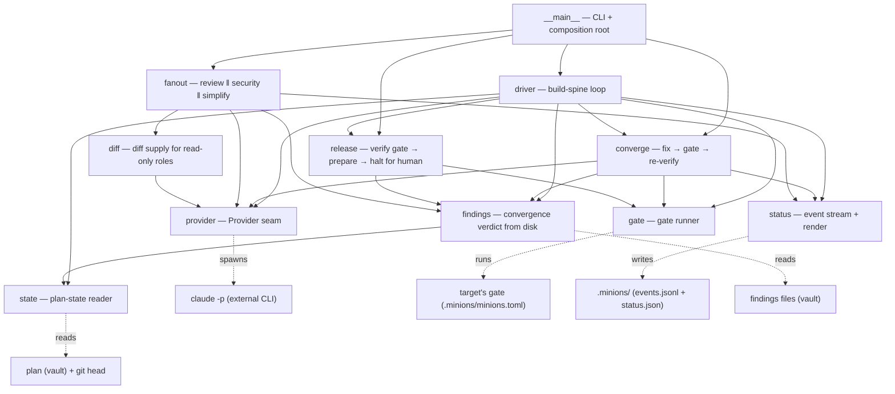

# Architecture

## What it is

MinionsFactory is a **CLI + orchestrator for autonomous Python feature development with Claude Code**. Pointed
at a target repo, it drives a vault-backed implementation plan to completion: a fresh, per-phase **coder** builds the plan
phase by phase (the orchestrator runs the quality gate itself and commits on green); at plan end it fans out
**review ‖ security ‖ simplify** as fresh read-only instances, runs a **converge loop** over their blocking
findings, then a **release** stage verifies the release gate and prepares the release locally — halting for the
human to merge + push (the boundary never crosses). Every role is a fresh, single-role Claude Code instance behind a
**provider seam**; the driver is deterministic control flow that **advances or halts** on machine-checkable disk
state.

## Load-bearing invariants

The rules that explain why the code is shaped the way it is:

1. **No LLM in the orchestration layer.** The driver is deterministic, unit-testable Python control flow; the
   only LLM is the role instance it spawns.
2. **The orchestrator runs the objective checks itself** — the gate and git state — so the agent it drives
   cannot game them.
3. **State lives on disk.** "Where are we" is reconstructed from the plan's `current_phase` + the progress
   ledger + git — never from memory, so resume is free.
4. **Roles are fresh instances behind a `Provider` seam.** The driver depends on a Protocol, never on the
   `claude` CLI — harness-agnostic and unit-testable.
5. **Advance is detected, not trusted.** A phase advances only when a new commit landed **and** `current_phase`
   moved; a role's self-report is captured for observation but never trusted for the verdict.
6. **The framework's own green gate is the definition of done** (`ruff` `D`+`ANN` → `ty` strict → `pytest`),
   dogfooded on itself.
7. **Observability is a projection of on-disk state, not `print`.** Typed events go to an append-only log + a
   snapshot; the sink defaults to a no-op, so the driver's logic never depends on whether anyone is listening.
8. **Fakes are first-class parts of each seam and ship in the package.** No unit test spawns `claude` or runs a
   real gate — the subprocess edges are exercised only in an end-to-end dogfood run.

## Dependency graph

Arrows mean "imports / calls". Dotted arrows cross into external systems.

The key structural fact: **the driver depends on seams**, not on the CLIs behind them. In tests it is handed
[`FakeProvider`](modules/provider.md#fakeprovider) / [`FakeGate`](modules/gate.md#fakegate); in a real run,
[`ClaudeCodeProvider`](modules/provider.md#claudecodeprovider) / [`SubprocessGate`](modules/gate.md#subprocessgate).
Same driver code, no `if testing:` branches — this is what makes the whole loop unit-testable without ever
spawning Claude or running a real gate.

Per-module detail (signatures, edge cases, data flow) lives in [`modules/`](modules/). The deep design
rationale (why structural typing over an ABC, the read-only permission regime, and other settled trade-offs)
lives in the vault's `decisions.md`, linked from the module docs that touch it.
