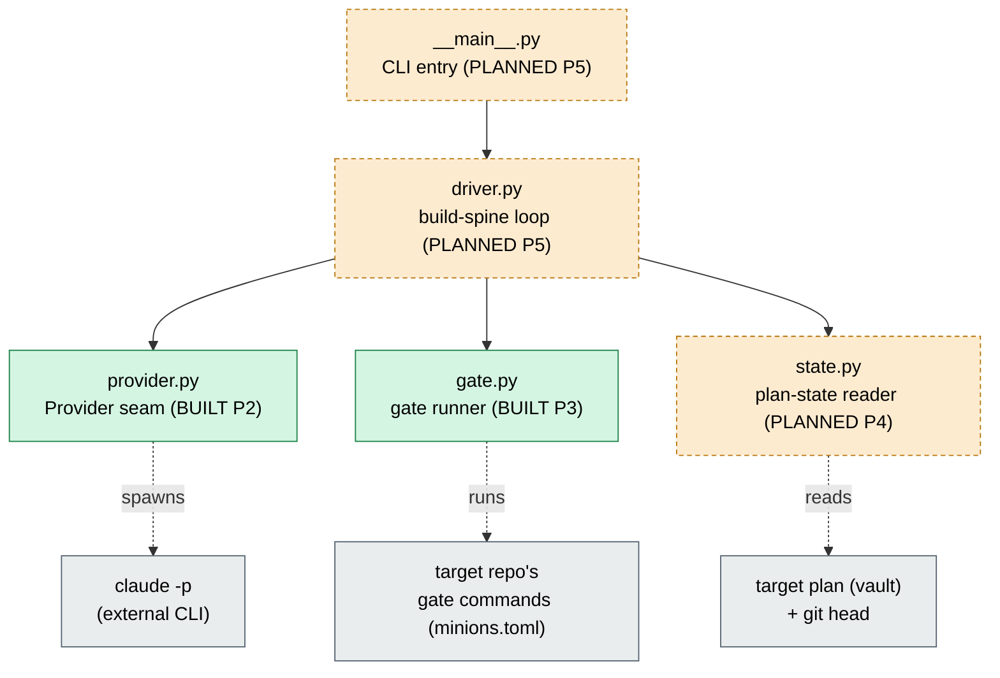

# Architecture — MinionsFactory v0.1 (the coder build spine)

## What v0.1 is

MinionsFactory is a **CLI + orchestrator for autonomous Python feature development with Claude Code**.
Pointed at a target repo, it drives a vault-backed implementation plan to completion.

**v0.1 builds only the minimal spine:** spawn one role — the **coder** — as a fresh headless
`claude -p` instance → **the orchestrator runs the target's quality gate itself** → on green, advance +
commit; otherwise **halt**. The end-of-plan fan-out (review ‖ security ‖ simplify), the converge loop,
release automation, the installed CLI, and the UI are all out of scope for v0.1.

## The load-bearing invariants (why the code is shaped the way it is)

1. **No LLM in the orchestration layer.** The driver is deterministic, unit-testable Python control
   flow. The only LLM is the coder instance it spawns.
2. **The orchestrator runs the objective checks itself** — the gate and git state — so the agent it
   drives cannot game them.
3. **State lives on disk.** "Where are we" is reconstructed from the plan's `current_phase` + the
   progress ledger + git — never from memory. Resume is therefore free.
4. **Roles are fresh instances behind a provider seam.** The driver depends on a `Provider` **Protocol**,
   never on the `claude` CLI directly — harness-agnostic and unit-testable.
5. **The framework's own green gate is the definition of done** (`ruff` `D`+`ANN` → `ty` strict →
   `pytest`), dogfooded on itself.

## Package layout (built vs. planned)

```
orchestrator/
├── __init__.py     # package marker + a trivial describe() smoke keeper          [BUILT  P1]
├── provider.py     # Provider seam: Protocol + ClaudeCodeProvider + FakeProvider [BUILT  P2]
├── gate.py         # run the target's gate itself -> GateResult (+ FakeGate)      [BUILT  P3]
├── state.py        # read_plan_state(...) -> PlanState (state-from-disk)          [PLANNED P4]
├── driver.py       # run(...) — the build-spine loop + halt-contract + resume    [PLANNED P5]
└── __main__.py     # `python -m orchestrator run --repo <target>`                 [PLANNED P5]
```

Supporting infrastructure already in place: the **own strict gate** (`pyproject.toml`: `ruff` with
`D`+`ANN` and `pep257`, `ty` strict via `error-on-warning`, `pytest`), **CI** mirroring it
(`.github/workflows/ci.yml`), the proven role **prompts/**, and a committed **`uv.lock`**.

## Component & dependency graph

Arrows mean "depends on / calls". Dashed nodes are **planned**.



The key structural fact: **the driver depends on seams** (`Provider`, and the planned `Gate`), not on
the CLIs behind them. In tests the driver is handed `FakeProvider`/`FakeGate`; in a real run it is handed
`ClaudeCodeProvider` and the real gate. Same driver code, no `if testing:` branches — this is what makes
the whole loop unit-testable without ever spawning Claude or running a real gate.

## The seam pattern (dependency inversion via `typing.Protocol`)

A `Provider` is defined by *having a `run_role` method*, not by inheriting a base class (structural
typing). Two concrete adapters satisfy it without any shared parent:

- **`ClaudeCodeProvider`** — the real adapter: build a `claude -p … --output-format json` argv, run it
  in the target repo, parse the JSON result.
- **`FakeProvider`** — a scripted double that returns a preset result and spawns nothing.

The same pattern is now realized for the gate (`Gate` Protocol + real `SubprocessGate` + `FakeGate`, built
in P3). Fakes are treated as **first-class parts of the seam** and ship inside the package (not in
`tests/`), so anyone integrating against a seam can exercise the driver without real side effects.

Another recurring rule visible in `provider.py`: **Pydantic at the trust boundary, plain dataclasses
inside.** `RoleResult` parses untrusted subprocess JSON (Pydantic, tolerant of unknown fields);
`Profile` is internal config (a frozen dataclass — no validation theater).

### Why not inheritance? (structural typing, and why it's load-bearing)

`ClaudeCodeProvider` and `FakeProvider` deliberately **do not inherit `Provider`**. Python offers two
kinds of "interface", and we chose the structural one on purpose:

| | **Nominal** (not used here) | **Structural** (what we use) |
| --- | --- | --- |
| Mechanism | `abc.ABC` + `class Foo(Base)` | `typing.Protocol`, no subclassing |
| "Is it a `Provider`?" | it *inherited* the base | it *has the matching method shape* |
| Coupling on implementers | must import + subclass our base | must know **nothing** about our seam |

**This is driven directly by the harness-agnostic goal.** MinionsFactory is meant to drive other coding
agents later (opencode, pi, Codex) via small adapters. With a `Protocol`, an adapter author just writes a
class with a compatible `run_role` and it *is* a `Provider` — **they never import or subclass anything of
ours.** An ABC would force every adapter to depend on `orchestrator`'s base class, reintroducing exactly
the vendor coupling the design exists to avoid (and letting the weakest/most-coupled adapter set the
floor). Structural typing keeps the seam definition and its implementations fully decoupled.

**Where the contract is enforced:** not by a class hierarchy, but **statically by `ty`**, at every point
a value flows into a `Provider`-typed slot — a `: Provider` parameter (the driver's case), a `: Provider`
variable, a `-> Provider` return, or a `Provider` field. At each such site `ty` checks that the type is
assignable to `Provider`, verifying **every** declared member matches with a compatible signature
(parameter names/types + return type), not merely that a method by that name exists. A mismatch turns the
gate red *before* the program runs — there is no runtime `isinstance` (a `Protocol` isn't runtime-checkable
unless decorated `@runtime_checkable`, which we don't need). So in this codebase **"is a `Provider`"** and
**"passes the gate"** are the same statement.

You *can* subclass a `Protocol` for explicitness (`class ClaudeCodeProvider(Provider)`), and `ty` would
then check conformance at the class definition instead of only at use sites. We choose not to: the
implicit form keeps adapters decoupled from our code, and `ty` catches mistakes either way. Explicitness
was judged not worth the coupling for a seam whose whole reason to exist is provider-neutrality.

## Roadmap (P0 → P6)

| Phase | Deliverable | Status |
| --- | --- | --- |
| P0 | Repo + Q1 permission spike (recorded) + minimal `pyproject.toml` | **done** |
| P1 | `orchestrator/` skeleton behind the own strict gate + CI + prompts | **done** |
| P2 | Provider seam + Claude Code adapter (`run_role`) | **done** |
| P3 | Gate runner — run the target's gate itself (per-repo command list) + `FakeGate` | **done** |
| P4 | Plan-state reader (state-from-disk; highest-version plan selection) | planned |
| P5 | Build-spine driver + halt-contract (advance / commit / halt / resume) | planned |
| P6 | Dogfood: drive the isekai v0.6 plan for real (`claude -p`, real gate) | planned |

See [data-flow.md](data-flow.md) for how these pieces execute together, and
[modules/orchestrator.md](modules/orchestrator.md) for the current API surface.
