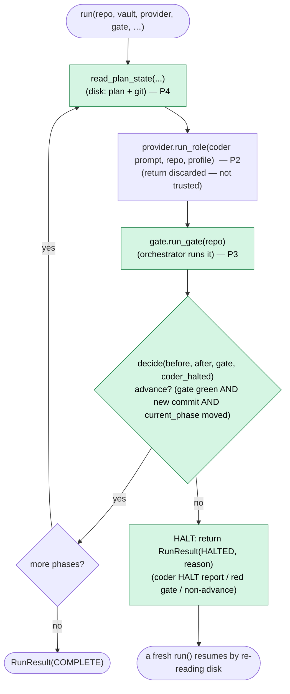
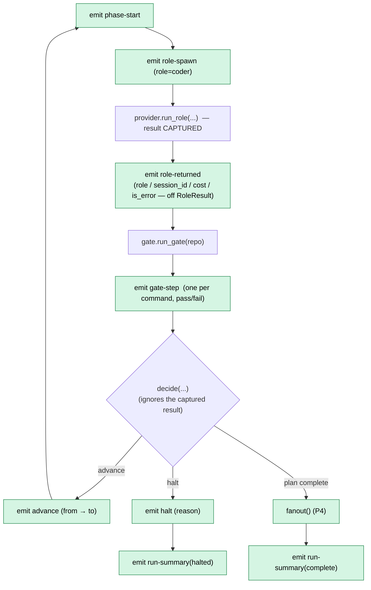
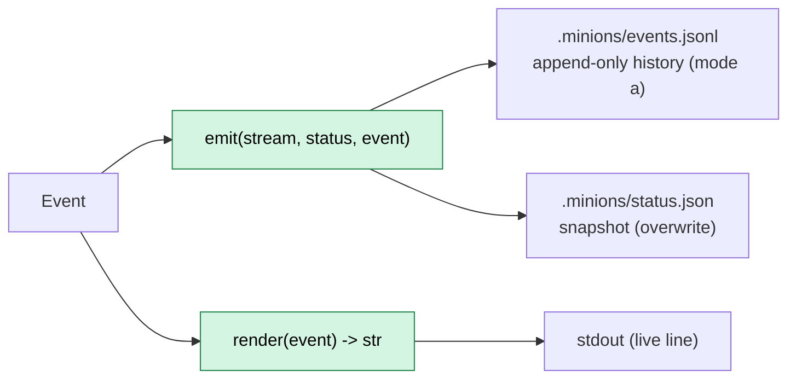
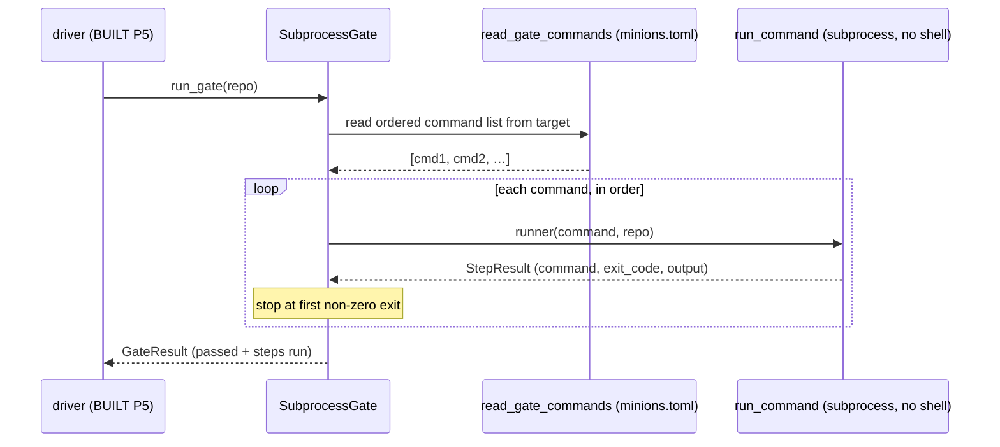
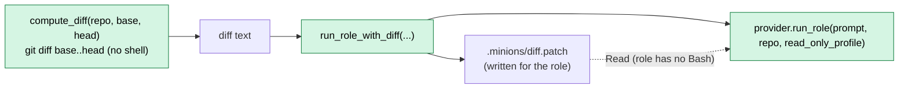
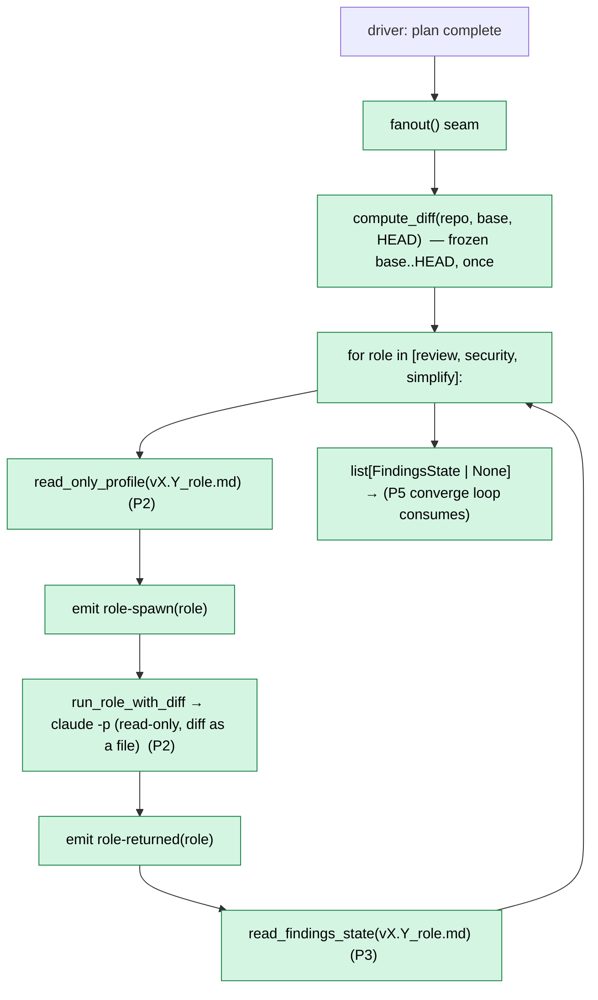
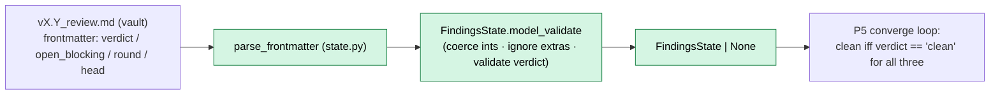

# Data & control flow

All v0.1 orchestrator modules are built (P2–P5): the provider seam, the gate runner, the plan-state
reader, and the build-spine loop that ties them together. The only thing exercised solely against the real
world (real `claude`, real git) — and therefore not unit-tested — is the subprocess edge, run for real in
the P6 dogfood. **v0.2 P1** adds a status/event stream woven through that loop (below).

## Built today — running one role (`run_role`)

`ClaudeCodeProvider.run_role` is three moves. The middle one is the only side effect; the outer two are
pure and unit-tested. This is the **invoke/parse split** — isolate the untestable subprocess so all the
logic that can be *wrong* (argv assembly, JSON parsing) is pure.

```mermaid
sequenceDiagram
    participant Caller as caller (driver, BUILT P5)
    participant P as ClaudeCodeProvider
    participant BC as build_command()
    participant Sub as subprocess.run (claude -p)
    participant PR as parse_result()

    Caller->>P: run_role(role_prompt, repo, profile)
    P->>BC: build_command(role_prompt, profile)
    BC-->>P: argv list (claude -p … --output-format json)
    Note over P,Sub: list argv, never shell=True (injection-safe)
    P->>Sub: subprocess.run(argv, cwd=repo, check=True, text=True)
    Sub-->>P: stdout (JSON result)
    P->>PR: parse_result(stdout)
    PR-->>P: RoleResult (Pydantic; unknown fields ignored)
    P-->>Caller: RoleResult
```

Testability map:

| Piece | Pure? | Unit-tested? |
| --- | --- | --- |
| `build_command(role_prompt, profile)` | yes | yes — argv includes headless JSON + profile perms |
| `subprocess.run(...)` | no (spawns `claude`) | **no** — exercised only in the P6 dogfood |
| `parse_result(stdout)` | yes | yes — parses the JSON fields, tolerates extra keys |

`FakeProvider.run_role` short-circuits the whole diagram: it returns a scripted `RoleResult` and spawns
nothing — this is what the driver's tests use.

## Built — the build-spine loop (P5)

The driver is deterministic control flow with **no LLM**. Advance is **detected, not trusted**: a phase
only advances when a new commit landed **and** the plan's `current_phase` moved. Everything it reads
comes from disk, so resume is free. The verdict is a pure `decide(before, after, gate_result,
coder_halted)`; the effectful `run()` loop calls it and acts.



Halt conditions (P5): a HALT report from the coder, a non-advancing phase (gate green but no
commit / `current_phase` didn't move), or a persistently-red gate.

## Built — the status/event stream (v0.2 P1)

The same loop, now **observable**. The driver takes an injected `emit_event` sink and calls it around each
observation it already makes — no new decisions, just narration. The events are the orchestrator's own
view (it *observes* the role from outside; the role never emits), so the stream can't be gamed — the same
posture as the orchestrator-run gate.



The load-bearing nuance: `provider.run_role(...)`'s return is **captured** to fill the `role-returned`
event, yet `decide(...)` still **ignores it** (advance is detected from disk). *Surfaced for observation,
discarded for the verdict.* Every terminal path — complete, decision-halt, runaway guard — ends with a
`run-summary`. **P4** unified the coder/fan-out spawn events into one `role-spawn`/`role-returned` pair
(the coder is `role="coder"`), and slotted `fanout()` in on the plan-complete edge (before the final
summary; a halt never reaches it).

Each event is both **appended** to `events.jsonl` (immutable history) and written to `status.json` (the
latest-event snapshot), then `render`ed to a stdout line — the log-vs-snapshot split:



Testability map:

| Piece | Pure/logic? | Unit-tested? |
| --- | --- | --- |
| `render(event)` | yes | yes — literal line per variant; exhaustive `match` (no `case _`) |
| `append_event` / `read_events` | yes (file IO) | yes — round-trips to the typed variant |
| `emit` / `read_status` | yes (file IO) | yes — snapshot = latest event only |
| `is_in_progress(status)` | yes | yes — a dangling `role-spawn` reads as running |
| `run(..., emit_event=spy)` | yes (with a spy sink) | yes — emitted kind-sequence + key fields |
| `_make_emitter` / `emit_and_render` (`__main__`) | no (disk + stdout) | **no** — composition root, validated by running |

## Built today — the gate runner (`SubprocessGate.run_gate`)

The orchestrator runs the **target's** gate itself so it can't be gamed. The command list is **read from
the target's `minions.toml`** (language-neutral: a Python target and a JS target differ only in config, not
in orchestrator code). It runs the commands in order and **stops at the first failure**.



Same **injected-seam** pattern as the provider, with one twist: the gate's fail-fast *logic* is
unit-tested by injecting a **fake `runner`** (scripted `StepResult`s), while the real `run_command`
(`shlex.split` → `subprocess.run(check=False)`) is the untested side effect — exercised only in P6.
`check=False` here is deliberate (opposite of the provider's `check=True`): a red gate is an *expected
signal* to capture, not an exception to raise. `FakeGate.run_gate` short-circuits the whole diagram with a
scripted `GateResult` — that's what the driver's tests inject.

Testability map:

| Piece | Pure/logic? | Unit-tested? |
| --- | --- | --- |
| `read_gate_commands(repo)` | yes (file read) | yes — parses the ordered list from `minions.toml` |
| `SubprocessGate.run_gate` (loop, fail-fast) | yes (with injected runner) | yes — all-pass + stop-at-first-red |
| `run_command(...)` | no (spawns tools) | **no** — exercised only in the P6 dogfood |

### Example: a target's `minions.toml`

A driven repo declares its gate as an ordered command list at its root — the whole per-repo config the
gate runner reads. Swapping it (e.g. for a JS target's `npm`/`pnpm` commands) needs **no orchestrator
change**; that language-neutrality is the point.

```toml
# minions.toml — at the *target* repo root
gate = [
  "uv sync --locked",
  "uv run ruff format --check .",
  "uv run ruff check .",
  "uv run ty check",
  "uv run pytest",
]
```

The commands run in order and the gate stops at the first non-zero exit. (This example mirrors
MinionsFactory's own gate — the same shape isekai gets in P6. Note MinionsFactory itself is *not* driven
in v0.1, so it carries no `minions.toml`; this block is illustrative.)

## Built — diff supply for read-only roles (v0.2 P2)

A read-only role (review / security / simplify) has **no `Bash`**, so it cannot `git diff` itself — the
orchestrator computes the diff and **hands it over as a file**. `compute_diff(repo, base, head)` runs
list-argv git (`git diff base..head`) via an injected runner; `run_role_with_diff` writes that text under
the target's `.minions/` and runs the role, whose prompt carries only the *path* (a large diff never
bloats the prompt).



Two scopes, one function: **`base..HEAD`** (frozen — the whole feature) feeds fan-out (P4);
**`head..HEAD`** (just the fix) feeds re-verify (P5), scoping the verifier to the fix so the finding set
shrinks and the loop terminates. The read-only `Profile` (`read_only_profile(findings)`) denies
`Bash`+`Edit` and allows `Write` only to the role's findings file — the *sound* half of the Q1 permission
finding (bare-tool denies enforce); the sandbox (≥ v0.3) will make it a mount-fact. Everything but the real
`git diff` subprocess is unit-tested behind an injected runner / `FakeProvider`.

## Built — the end-of-plan fan-out (v0.2 P4, dogfood pending)

Where v0.1's `run()` returned `COMPLETE`, the driver now invokes the injected `fanout` seam first (only on
completion — a halt returns earlier). `run_fanout` is a **sequential loop over a `RoleSpec` table** that
composes P1–P3: for each of review/security/simplify it builds the read-only profile, injects the frozen
diff, spawns the role, and reads back its verdict.



**Sequential-first** (the `‖` is deterministic-simplest as a loop; parallel is a noted-not-built
optimization) and **data-driven** (one loop, not three copy-paste functions — the "overlapping paths" smell
`simplify` itself flags). Everything but the real `claude -p` spawns is unit-tested behind a recording
`FakeProvider` (three read-only spawns over the frozen diff, per-role events, verdicts collected). The
**first live run — `simplify.md`'s debut — is the P4 dogfood, still pending**. The collected
`FindingsState`s are what the **P5 converge loop** will act on.

## Built — the findings reader = the convergence signal (v0.2 P3)

`read_findings_state(path) -> FindingsState | None` reads a role's findings file into a validated verdict
(`verdict` / `open_blocking` / `round` / `head`), reusing `parse_frontmatter` — no new parser. It is the
**read-half of the converge loop** and the enforcement of principle 2: the orchestrator keys convergence on
`verdict`/`open_blocking` written to disk by the **verify pass**, never on what the **fixer** returns (the
fixer only flips a finding `open → fixed`; the verifier owns the counters). So a fixer cannot lie its way
to "converged".



A **missing** file → `None` (a not-yet-run role, not a crash); `verdict` is a strict `Literal`, so a typo'd
verdict is rejected at read and `ty` forces the loop to handle the `None` case. `FindingsState` is Pydantic
(unlike the dataclass `PlanState`) because *this* boundary read has ints to coerce and a closed verdict to
validate — Pydantic-where-it-needs-validating, not merely at-any-boundary.

## The state-on-disk backbone (why resume is free)

Every arrow that crosses a role/phase boundary is mediated by **files on disk**, never in-memory state:

- the **target plan** (frontmatter `current_phase` + `phaseN` flags) — read by `read_plan_state` (`state.py`, built P4);
- **git** (did a new commit land?) — read by the driver (P5);
- the **HALT contract** the coder writes on genuine ambiguity — read on resume (P5);
- the framework's own **`CHANGELOG.md`** + per-phase commits — the resumable record of what shipped.

Because the loop keeps nothing in memory, a crashed or compacted run resumes by simply re-reading disk.
