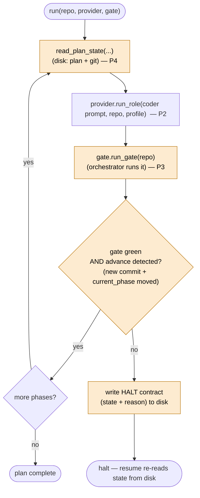
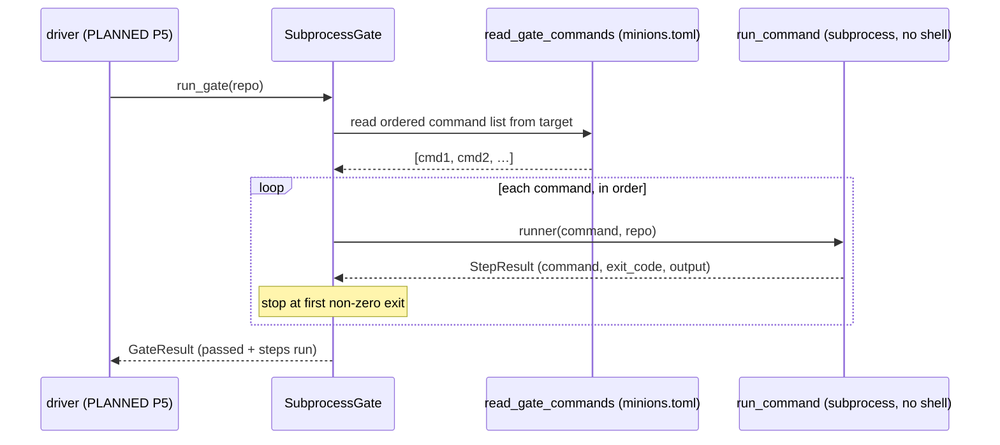

# Data & control flow

Two views: **what runs today** (the provider seam built in P2 + the gate runner built in P3) and **the
planned build-spine loop** (P4–P5) that will call them. Planned pieces are labelled as such.

## Built today — running one role (`run_role`)

`ClaudeCodeProvider.run_role` is three moves. The middle one is the only side effect; the outer two are
pure and unit-tested. This is the **invoke/parse split** — isolate the untestable subprocess so all the
logic that can be *wrong* (argv assembly, JSON parsing) is pure.

```mermaid
sequenceDiagram
    participant Caller as caller (driver, PLANNED)
    participant P as ClaudeCodeProvider
    participant BC as build_command()
    participant Sub as subprocess.run (claude -p)
    participant PR as parse_result()

    Caller->>P: run_role(role_prompt, repo, profile)
    P->>BC: build_command(role_prompt, profile)
    BC-->>P: argv list (claude -p … --output-format json)
    Note over P,Sub: list argv, never shell=True (injection-safe)
    P->>Sub: subprocess.run(argv, cwd=repo, check=True, text=True)
    Sub-->>P: stdout (JSON result)
    P->>PR: parse_result(stdout)
    PR-->>P: RoleResult (Pydantic; unknown fields ignored)
    P-->>Caller: RoleResult
```

Testability map:

| Piece | Pure? | Unit-tested? |
| --- | --- | --- |
| `build_command(role_prompt, profile)` | yes | yes — argv includes headless JSON + profile perms |
| `subprocess.run(...)` | no (spawns `claude`) | **no** — exercised only in the P6 dogfood |
| `parse_result(stdout)` | yes | yes — parses the JSON fields, tolerates extra keys |

`FakeProvider.run_role` short-circuits the whole diagram: it returns a scripted `RoleResult` and spawns
nothing — this is what the driver's tests use.

## Planned — the build-spine loop (P5)

The driver is deterministic control flow with **no LLM**. Advance is **detected, not trusted**: a phase
only advances when a new commit landed **and** the plan's `current_phase` moved. Everything it reads
comes from disk, so resume is free.



Halt conditions (P5): a HALT report from the coder, a non-advancing phase (gate green but no
commit / `current_phase` didn't move), or a persistently-red gate.

## Built today — the gate runner (`SubprocessGate.run_gate`)

The orchestrator runs the **target's** gate itself so it can't be gamed. The command list is **read from
the target's `minions.toml`** (language-neutral: a Python target and a JS target differ only in config, not
in orchestrator code). It runs the commands in order and **stops at the first failure**.



Same **injected-seam** pattern as the provider, with one twist: the gate's fail-fast *logic* is
unit-tested by injecting a **fake `runner`** (scripted `StepResult`s), while the real `run_command`
(`shlex.split` → `subprocess.run(check=False)`) is the untested side effect — exercised only in P6.
`check=False` here is deliberate (opposite of the provider's `check=True`): a red gate is an *expected
signal* to capture, not an exception to raise. `FakeGate.run_gate` short-circuits the whole diagram with a
scripted `GateResult` — that's what the driver's tests inject.

Testability map:

| Piece | Pure/logic? | Unit-tested? |
| --- | --- | --- |
| `read_gate_commands(repo)` | yes (file read) | yes — parses the ordered list from `minions.toml` |
| `SubprocessGate.run_gate` (loop, fail-fast) | yes (with injected runner) | yes — all-pass + stop-at-first-red |
| `run_command(...)` | no (spawns tools) | **no** — exercised only in the P6 dogfood |

### Example: a target's `minions.toml`

A driven repo declares its gate as an ordered command list at its root — the whole per-repo config the
gate runner reads. Swapping it (e.g. for a JS target's `npm`/`pnpm` commands) needs **no orchestrator
change**; that language-neutrality is the point.

```toml
# minions.toml — at the *target* repo root
gate = [
  "uv sync --locked",
  "uv run ruff format --check .",
  "uv run ruff check .",
  "uv run ty check",
  "uv run pytest",
]
```

The commands run in order and the gate stops at the first non-zero exit. (This example mirrors
MinionsFactory's own gate — the same shape isekai gets in P6. Note MinionsFactory itself is *not* driven
in v0.1, so it carries no `minions.toml`; this block is illustrative.)

## The state-on-disk backbone (why resume is free)

Every arrow that crosses a role/phase boundary is mediated by **files on disk**, never in-memory state:

- the **target plan** (frontmatter `current_phase` + progress ledger) — read by `state.py` (P4);
- **git** (did a new commit land?) — read by the driver (P5);
- the **HALT contract** the coder writes on genuine ambiguity — read on resume (P5);
- the framework's own **`CHANGELOG.md`** + per-phase commits — the resumable record of what shipped.

Because the loop keeps nothing in memory, a crashed or compacted run resumes by simply re-reading disk.
