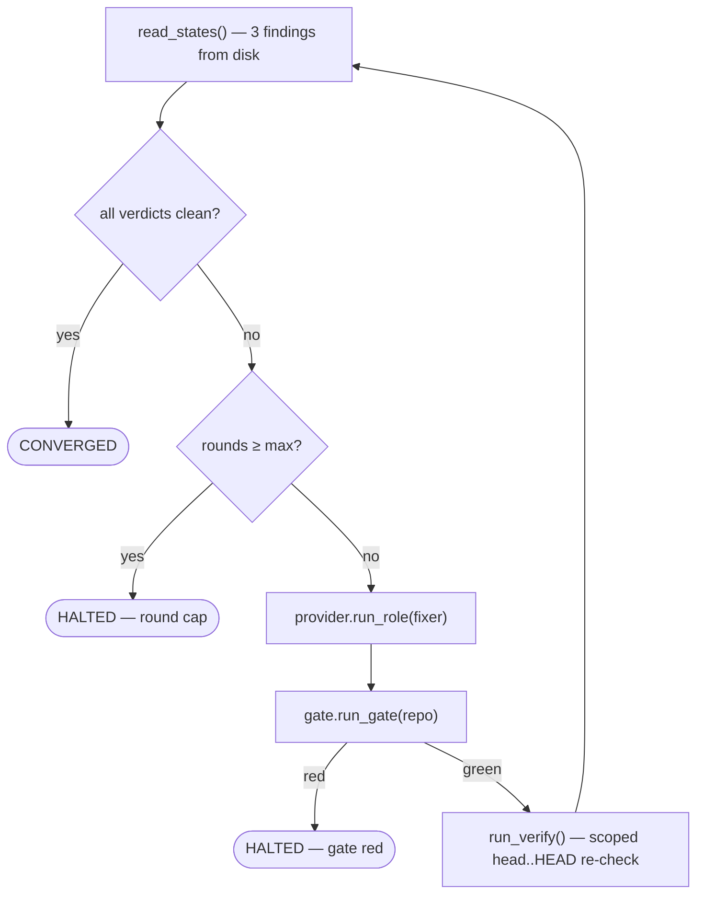

# `converge`

Drive open **blocking** findings to clean by looping *fix → gate → re-verify*, or halt.

## What it does

Given the findings files a review / security / simplify pass wrote, [`converge`](#converge) repeatedly spawns a
fix pass and re-verifies until every verdict on disk reads `clean` — or gives up. It is pure control flow over
on-disk state: **no LLM decides when it's done**, and the fixer is never trusted to say so itself.

## Boundaries

It does not decide *what* is wrong (the read-only roles do) and it does not review the fix (the injected
`run_verify` pass writes the verdict). `converge` only loops and reads the disk verdict.

## Data flow



## How clients use it

```python
result = converge(
    provider,
    gate,
    repo,
    fixer_prompt=coder_prompt,
    coder_profile=coder_profile,
    read_states=lambda: [read_findings_state(p) for p in findings_paths],
    run_verify=run_verify,
)
if result.status is ConvergeStatus.HALTED:
    ...  # halt the build run, surface result.reason
```

## Edge cases & invariants

- A **missing** findings file (`None`) counts as *not clean* — a not-yet-run verify keeps the loop going and can
  never converge falsely.
- The findings are re-read from disk **every round**; nothing is cached in memory between rounds.
- The fixer's return value is **discarded** — convergence is read from the findings files, not from what the
  fixer claims (so a fixer cannot lie its way to "converged").
- The clean check happens **before** the round-cap check, so an already-clean input converges in zero rounds.

## Reference

### `ConvergeStatus`

```python
class ConvergeStatus(Enum):   # CONVERGED | HALTED
```

The two ways a converge run ends. The driver branches on it — `HALTED` halts the whole build run.

### `ConvergeResult`

```python
@dataclass(frozen=True)
class ConvergeResult:
    status: ConvergeStatus
    reason: str  # "" when converged
    rounds: int
```

A converge run's outcome — how it ended, why, and how many fix rounds it took.

- **Returned to** — [`driver.run`](driver.md#run), which halts the build when `status` is `HALTED`.

### `converge`

```python
def converge(
    provider, gate, repo, fixer_prompt, coder_profile,
    read_states, run_verify, emit_event=_no_emit, max_rounds=3,
) -> ConvergeResult
```

Drives open blocking findings to clean, or halts. The loop is pure control flow over on-disk state.

- **Params** — [`provider`](provider.md#provider), [`gate`](gate.md#gate): spawn the fixer + run the target's gate · `repo`: the target repo · `fixer_prompt`, [`coder_profile`](provider.md#profile): the fix-pass role + its build permissions · `read_states`: re-reads the three findings from disk each round (the convergence signal) · `run_verify`: the scoped `head..HEAD` re-check that updates the findings · `emit_event`: the status sink (default no-op) · `max_rounds`: fix-round cap (default 3).
- **Returns** — [`ConvergeResult`](#convergeresult): `CONVERGED`, or `HALTED` with a reason.
- **Edge cases** — a missing findings file (`None`) counts as *not clean*, so a not-yet-run verify never converges falsely.
- **Gotchas** — `read_states()` is re-read **every round** (findings change on disk between rounds); the fixer's [`RoleResult`](provider.md#roleresult) is **discarded** — the verdict comes from disk. It emits one `gate-step` per round with an empty `command` (the gate is run as a whole, not per sub-command here).
- **Halts when** — `rounds ≥ max_rounds` (`"round cap exceeded"`), or a red gate after a fix (`"gate red after fix"`).
- **Called by** — [`driver.run`](driver.md#run) via the injected `converge` seam (once, after fan-out); composed in [`__main__`](main.md) by `_make_converge`.
- **Source** — [`converge.py`](../../orchestrator/converge.py) · **Tests** — [`test_converge.py`](../../tests/test_converge.py)
