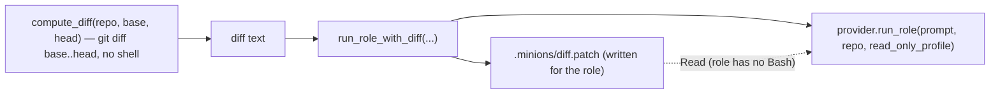

# `diff`

A read-only role has no `Bash`, so it cannot `git diff` itself — the orchestrator computes the diff and hands
it over as a **file**.

## What it does

[`compute_diff`](#compute_diff) runs list-argv git (`git diff base..head`) via an injected runner;
[`run_role_with_diff`](#run_role_with_diff) writes that text under the target's `.minions/` and runs the role,
whose prompt carries only the *path* — a large diff never bloats the prompt.

## Boundaries

It does not choose the commit range (the caller does) or interpret the diff (the role does). Two scopes serve
two callers: **`base..HEAD`** (frozen — the whole feature) feeds [`fan-out`](fanout.md); **`head..HEAD`** (just
the fix) feeds re-verify inside the [`converge`](converge.md) loop, scoping the verifier to the fix so the
finding set shrinks and the loop terminates.

## Data flow



## How clients use it

```python
diff = compute_diff(repo, base="main", head="HEAD")  # frozen feature diff
result = run_role_with_diff(
    provider,
    reviewer_prompt,
    repo,
    read_only_profile(findings_file),
    diff,
    diff_path=repo / ".minions" / "diff.patch",
)
```

## Edge cases & invariants

- Git runs as a **list argv**, never a shell string.
- `compute_diff` uses `check=True` (like the provider, unlike the gate): a failing `git diff` is an error to
  surface, not a signal to capture.
- `run_role_with_diff` creates the diff file's parent (`mkdir(parents=True, exist_ok=True)`), so it does not
  depend on the emitter having run first.
- The real `_run_git` subprocess is the only untested edge; everything else is tested behind an injected runner
  and [`FakeProvider`](provider.md#fakeprovider).

## Reference

### `compute_diff`

```python
def compute_diff(
    repo: Path, base: str, head: str,
    runner: Callable[[list[str], Path], str] = _run_git,
) -> str
```

Return the diff for **`base..head`** in `repo` (list-argv git, no shell).

- **Params** — `runner`: the injected git seam (defaults to the real `_run_git`, `subprocess.run(check=True)`); tests inject a stub.
- **Gotchas** — the caller picks the scope: `base..HEAD` for fan-out (the whole feature), `head..HEAD` for re-verify (just the fix — what makes converge terminate).
- **Called by** — the fan-out and converge closures in [`__main__`](main.md).
- **Source** — [`diff.py`](../../orchestrator/diff.py) · **Tests** — [`test_diff.py`](../../tests/test_diff.py)

### `run_role_with_diff`

```python
def run_role_with_diff(
    provider: Provider, role_prompt: str, repo: Path,
    profile: Profile, diff: str, diff_path: Path,
) -> RoleResult
```

Write `diff` to `diff_path`, then run the role via the [`provider`](provider.md#provider) — the prompt carries
only the *path*.

- **Params** — [`provider`](provider.md#provider), `profile` (typically [`read_only_profile`](provider.md#read_only_profile)): the seam + the read-only perms · `diff`, `diff_path`: the text to write and where.
- **Returns** — [`RoleResult`](provider.md#roleresult)
- **Why role-agnostic** — it is the primitive [`run_fanout`](fanout.md#run_fanout) composes per role (review / security / simplify differ only in prompt + findings file).
- **Source** — [`diff.py`](../../orchestrator/diff.py) · **Tests** — [`test_diff.py`](../../tests/test_diff.py)
