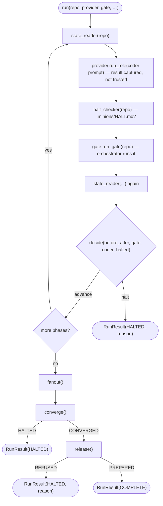

# `driver`

The deterministic driver — **no LLM** — that advances the active in-tree change phase by phase or halts. The
verdict is a pure function; the loop is thin orchestration over the seams.

## What it does

[`run`](#run) reads the [`ChangeState`](state.md#changestate) — from the **repo alone** — spawns the coder, lets
the orchestrator run the gate, re-reads state, and asks the pure [`decide`](#decide) whether the phase advanced.
Advance is **detected, not trusted**: a phase only advances when a new commit landed **and** the current-phase
index moved, a test [`decide`](#decide) delegates to [`change_advanced`](state.md#change_advanced) rather than
re-implementing. At change-complete it invokes the injected `fanout`, `converge`, then `release` seams before the
final summary.

## Boundaries

The driver owns *control flow only*. It does not spawn processes, run the gate, compute diffs, or decide what a
role does — those live behind the [`Provider`](provider.md#provider) / [`Gate`](gate.md#gate) / `fanout` /
`converge` seams it is handed. It never trusts a role's self-report: the coder's [`RoleResult`](provider.md#roleresult)
is captured for the `role-returned` event but **ignored** by `decide`.

## Data flow



## How clients use it

```python
result = run(
    repo,
    provider,
    gate,
    coder_prompt,
    coder_profile,
    emit_event=emit_event,  # optional status sink
    fanout=fanout_closure,  # optional post-build stages
    converge=converge_closure,
    release=release_closure,
)
exit_code = 0 if result.status is RunStatus.COMPLETE else 1
```

## Edge cases & invariants

- **Advance requires both** a new commit (`head` changed) **and** a moved current-phase index (a ticked
  `tasks.md` checkbox) — a green gate alone is not enough, and neither signal counts on its own.
- Precedence in `decide`: **halt-report → red-gate → non-advance → advance**.
- Every terminal path emits a `run-summary` (both halt paths emit `halt` then `run-summary`).
- `fanout`, `converge`, and `release` run **only at change-complete** — a halted build never reaches them; their
  defaults are no-ops, so a build-only run is valid. `release` runs only after `converge` **converges** (a
  converge halt returns first); a `REFUSED` release halts the run, a `PREPARED` release completes it.
- `max_phases` is a runaway guard; hitting it halts with a `run-summary`.
- Nothing is kept in memory across phases — a crashed or compacted run resumes by re-reading disk.

## Reference

### `Decision`

```python
@dataclass(frozen=True)
class Decision:
    advance: bool
    reason: str  # halt reason when advance is False; "" otherwise
```

One phase's verdict.

- **Produced by** — [`decide`](#decide); consumed inside [`run`](#run).

### `decide`

```python
def decide(before: ChangeState, after: ChangeState, gate_result: GateResult, coder_halted: bool) -> Decision
```

The pure verdict for one phase. Precedence: **halt-report → red-gate → non-advance → advance**, where advance
requires **both** a new commit and a moved current-phase index — delegated to
[`change_advanced`](state.md#change_advanced), not re-implemented here.

- **Params** — [`before`/`after`](state.md#changestate): change state around the phase · [`gate_result`](gate.md#gateresult): the gate verdict · `coder_halted`: did the coder write a HALT report.
- **Returns** — [`Decision`](#decision)
- **Gotchas** — a green gate with no commit / unmoved phase is **non-advance** (a halt), not a silent success.
- **Source** — [`driver.py`](../../orchestrator/driver.py) · **Tests** — [`test_driver.py`](../../tests/test_driver.py)

### `RunStatus` / `RunResult`

```python
class RunStatus(Enum):   # COMPLETE | HALTED

@dataclass(frozen=True)
class RunResult:
    status: RunStatus
    reason: str
    phases_advanced: int
```

The terminal outcome of a [`run`](#run): how it ended, why, and how far it got.

- **Consumed by** — [`main`](main.md#main), which maps `COMPLETE`/`HALTED` to exit `0`/`1`.

### `halt_report_exists`

```python
def halt_report_exists(repo: Path) -> bool
```

The thin IO helper `run` uses as its `halt_checker`: whether the coder left a `HALT.md` at
`<repo>/.minions/HALT.md`, alongside the run's other artefacts under the gitignored `.minions/`. It resolves no
directory outside the repo.

- **Source** — [`driver.py`](../../orchestrator/driver.py) · **Tests** — [`test_driver.py`](../../tests/test_driver.py)

### `run`

```python
def run(
    repo, provider, gate, coder_prompt, profile,
    state_reader=read_change_state, halt_checker=halt_report_exists,
    emit_event=_no_emit, fanout=_no_fanout, converge=_no_converge,
    release=_no_release, max_phases=100,
) -> RunResult
```

The loop: read [`ChangeState`](state.md#changestate) → `provider.run_role` → `halt_checker` → `gate.run_gate` →
read state again → [`decide`](#decide) → continue or halt; at change-complete, `fanout()` → `converge()` →
`release()`. It loops on `not before.is_complete`.

- **Params** — [`provider`](provider.md#provider), [`gate`](gate.md#gate): the spawn + gate seams · `coder_prompt`, [`profile`](provider.md#profile): the coder role + its build perms · `state_reader`: the injected disk seam, **repo-only** (`Callable[[Path], ChangeState]`, default [`read_change_state`](state.md#read_change_state)) · `halt_checker`: reads `<repo>/.minions/HALT.md` (`Callable[[Path], bool]`, default [`halt_report_exists`](#halt_report_exists)) — **repo-only**, like the state reader · `emit_event`: status sink (default no-op) · `fanout`, `converge`, `release`: post-build seams run once at completion (default no-ops) · `max_phases`: runaway guard.
- **Event labels** — a phase renders as `f"{index}: {title}"`. A **colon, not an em-dash**: [`status._short_phase`](status.md#render) trims a label by splitting on `" — "`, so an em-dash-separated label would render as the bare index and drop the title. `after.current` is `None` at completion, so the final `Advance` carries an explicit terminal label.
- **Returns** — [`RunResult`](#runstatus--runresult): `COMPLETE`, or `HALTED` with a reason.
- **Gotchas** — `provider.run_role(...)`'s return is **captured** (to fill `role-returned`) but **ignored** by `decide`; a `converge` that returns `HALTED` or a `release` that returns [`REFUSED`](release.md#releasestatus) turns a completed build into a halted run.
- **Halts when** — the coder wrote `HALT.md`, the gate is red, a phase didn't advance, `max_phases` is hit, a [`ProviderError`](provider.md#providererror) is raised (a `claude -p` non-zero exit — e.g. a usage limit — caught around the coder spawn → a clean, resumable halt), `converge` halted, or the [`release`](release.md#prepare_release) was refused.
- **Calls** — the five seams above; the `fanout`/`converge`/`release` closures are built in [`__main__`](main.md).
- **Source** — [`driver.py`](../../orchestrator/driver.py) · **Tests** — [`test_driver.py`](../../tests/test_driver.py)
