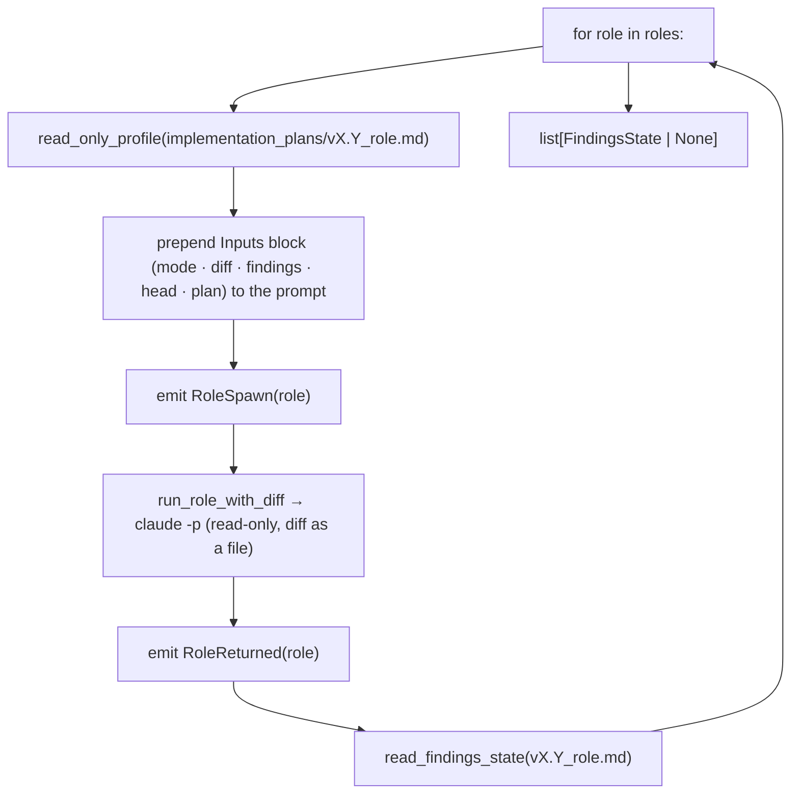

# `fanout`

Run the three read-only roles (review ‖ security ‖ simplify) over the frozen diff — the driver's first
post-build node.

## What it does

[`run_fanout`](#run_fanout) loops over a [`RoleSpec`](#rolespec) table; for each role it builds the read-only
profile, **prepends an orchestrator Inputs block** (mode · diff path · findings path · head SHA · plan/context) to
the role prompt — the read-only role has no shell to resolve those itself — injects the diff, spawns the role,
emits spawn/returned events, and reads back the verdict. It is pure **composition** of the lower modules — it
invents no mechanism. `mode` is `review` for the initial fan-out and `verify` for the converge re-run.

## Boundaries

It does not compute the diff (the caller freezes `base..HEAD` once and passes it in, so `run_fanout` needs no
git) and it does not *act* on the verdicts — it collects them for the [`converge`](converge.md) loop to consume.
**Sequential** (the `‖` is deterministic-simplest as a loop; parallel is a noted-not-built optimization) and
**data-driven** (one loop, not three near-identical functions — the "overlapping paths" smell `simplify` exists
to catch).

## Data flow



## How clients use it

```python
diff = compute_diff(repo, base, "HEAD")  # freeze base..HEAD once
states = run_fanout(
    provider,
    repo,
    vault_dir,
    version,
    diff,
    repo / ".minions" / "diff.patch",
    read_head(repo),  # the head SHA the role stamps into its findings frontmatter
    plan_path,
    roles=[RoleSpec("review", reviewer_prompt), ...],
    mode="review",  # "verify" on the converge re-run
    emit_event=emit_event,
)
```

## Edge cases & invariants

- The diff + head + plan path are passed **in** (the caller resolves them); `run_fanout` does no git and is fully
  unit-testable behind a recording [`FakeProvider`](provider.md#fakeprovider).
- Each role's findings file is `implementation_plans/${version}_{name}.md` in the vault — the **single** location
  the read-only profile grants write to, the role is told to write, and the [`converge`](converge.md) loop reads.
- The role has no shell, so the **orchestrator supplies the paths** via the prepended Inputs block; a role that
  never wrote its findings file collects as `None` (see [`read_findings_state`](findings.md#read_findings_state)).

## Reference

### `RoleSpec`

```python
@dataclass(frozen=True)
class RoleSpec:
    name: Role  # Literal["coder","review","security","simplify"] → findings filename + spawn label
    prompt: str
```

One fan-out role: its name (→ findings file `implementation_plans/${version}_{name}.md`, and the `role-spawn`
label) and its prompt text.

- **`name`** — the same [`Role`](status.md#event) alias the status events use (one source of truth).
- **Built by** — [`__main__`](main.md), which loads `reviewer.md` / `security.md` / `simplify.md` into three specs.

### `run_fanout`

```python
def run_fanout(
    provider: Provider, repo: Path, vault_dir: Path, version: str,
    diff: str, diff_path: Path, head: str, plan_path: Path, roles: Sequence[RoleSpec],
    mode: str = "review", emit_event: Callable[[Event], None] = _no_emit,
) -> list[FindingsState | None]
```

Run each read-only role over the supplied diff; collect each verdict from disk.

- **Params** — [`provider`](provider.md#provider): the spawn seam · `version`: plan version → findings filenames · `diff`, `diff_path`: the diff text and where to write it · `head`: the SHA the diff ends at (the role stamps it into `head:`) · `plan_path`: the plan the role reviews against · `roles`: the [`RoleSpec`](#rolespec) table · `mode`: `review` (initial) or `verify` (converge re-run) · `emit_event`: the status sink (defaults to a no-op).
- **Returns** — `list[FindingsState | None]`, one per role — what the [`converge`](converge.md#converge) loop consumes.
- **Calls** — [`read_only_profile`](provider.md#read_only_profile) · [`run_role_with_diff`](diff.md#run_role_with_diff) · [`read_findings_state`](findings.md#read_findings_state), per role.
- **Called by** — [`driver.run`](driver.md#run) via the `fanout` seam (built as a closure in [`__main__`](main.md)); reused inside the converge re-verify closure.
- **Source** — [`fanout.py`](../../orchestrator/fanout.py) · **Tests** — [`test_fanout.py`](../../tests/test_fanout.py)
