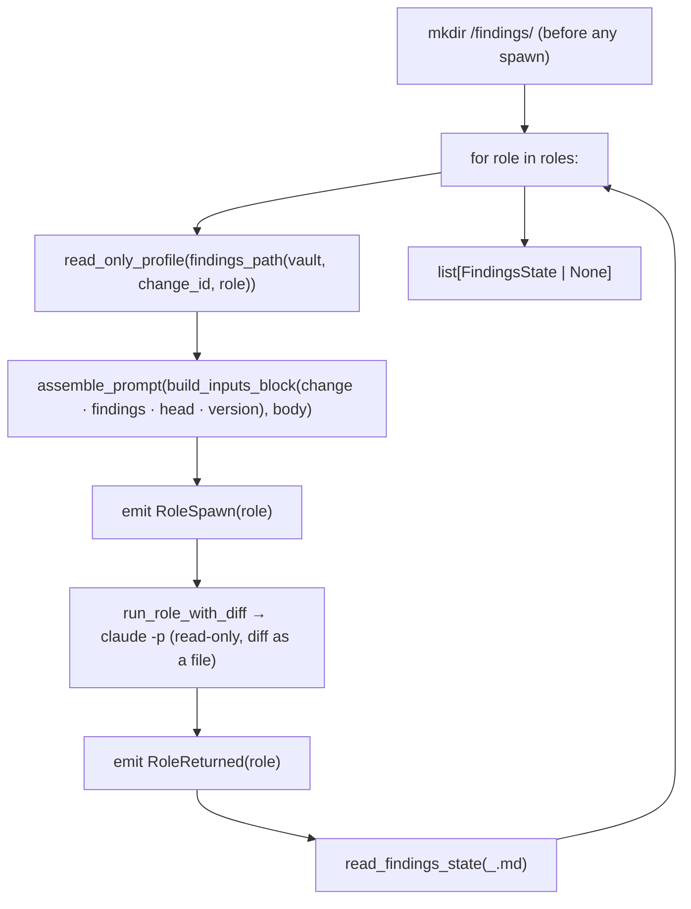

# `fanout`

Run the three read-only roles (review ‖ security ‖ simplify) over the frozen diff — the driver's first
post-build node.

## What it does

[`run_fanout`](#run_fanout) loops over a [`RoleSpec`](#rolespec) table; for each role it builds the read-only
profile, **prepends an orchestrator Inputs block** (mode · diff path · findings path · head SHA · change dir ·
version · context) to the role prompt — the read-only role has no shell to resolve those itself — injects the
diff, spawns the role, emits spawn/returned events, and reads back the verdict. It is pure **composition** of the
lower modules — it invents no mechanism. `mode` is `review` for the initial fan-out and `verify` for the converge
re-run.

The Inputs block itself is built by [`build_inputs_block`](#build_inputs_block) and joined to the role body by
[`assemble_prompt`](#assemble_prompt) — public, because **every** role gets one: the three read-only roles here,
and the coder, fixer and release roles [`__main__`](main.md) assembles from the same two functions.

## Boundaries

It does not compute the diff (the caller freezes `base..HEAD` once and passes it in, so `run_fanout` needs no
git) and it does not *act* on the verdicts — it collects them for the [`converge`](converge.md) loop to consume.
**Sequential** (the `‖` is deterministic-simplest as a loop; parallel is a noted-not-built optimization) and
**data-driven** (one loop, not three near-identical functions — the "overlapping paths" smell `simplify` exists
to catch).

## Data flow



## How clients use it

```python
diff = compute_diff(repo, base, "HEAD")  # freeze base..HEAD once
states = run_fanout(
    provider,
    repo,
    vault_dir,
    change_dir.name,  # the change id — the findings key
    version,
    diff,
    repo / ".minions" / "diff.patch",
    read_head(repo),  # the head SHA the role stamps into its findings frontmatter
    change_dir,
    roles=[RoleSpec("review", reviewer_prompt), ...],
    mode="review",  # "verify" on the converge re-run
    emit_event=emit_event,
)
```

## Edge cases & invariants

- The diff + head + change dir are passed **in** (the caller resolves them); `run_fanout` does no git and is fully
  unit-testable behind a recording [`FakeProvider`](provider.md#fakeprovider).
- Each role's findings file is `<vault>/findings/<change-id>_<role>.md`, resolved through the single
  [`findings_path`](findings.md#findings_path) site — the **one** location the read-only profile grants write to,
  the role is told to write, and the [`converge`](converge.md) loop and the release stage read.
- **`<vault>/findings/` is created before the first spawn.** A read-only role is granted `Write(<its file>)` and
  denied `Bash`, so it cannot create the directory itself, and a findings file that never lands reads as
  not-clean — a missing directory would silently fail every verdict.
- The role has no shell, so the **orchestrator supplies the paths** via the prepended Inputs block; a role that
  never wrote its findings file collects as `None` (see [`read_findings_state`](findings.md#read_findings_state)).

## Reference

### `RoleSpec`

```python
@dataclass(frozen=True)
class RoleSpec:
    name: Role  # Literal["coder","review","security","simplify"] → findings filename + spawn label
    prompt: str
```

One fan-out role: its name (→ findings file `<vault>/findings/<change-id>_<name>.md`, and the `role-spawn`
label) and its prompt text.

- **`name`** — the same [`Role`](status.md#event) alias the status events use (one source of truth).
- **Built by** — [`__main__`](main.md), which loads `reviewer.md` / `security.md` / `simplify.md` into three specs.

### `run_fanout`

```python
def run_fanout(
    provider: Provider, repo: Path, vault_dir: Path, change_id: str, version: str,
    diff: str, diff_path: Path, head: str, change_dir: Path, roles: Sequence[RoleSpec],
    mode: str = "review", emit_event: Callable[[Event], None] = _no_emit,
) -> list[FindingsState | None]
```

Run each read-only role over the supplied diff; collect each verdict from disk.

- **Params** — [`provider`](provider.md#provider): the spawn seam · `change_id`: the findings key · `version`: the release version the change declares · `diff`, `diff_path`: the diff text and where to write it · `head`: the SHA the diff ends at (the role stamps it into `head:`) · `change_dir`: the change the role reviews against · `roles`: the [`RoleSpec`](#rolespec) table · `mode`: `review` (initial) or `verify` (converge re-run) · `emit_event`: the status sink (defaults to a no-op).
- **Side effect** — creates `<vault>/findings/` before the first spawn (the read-only role cannot).
- **Returns** — `list[FindingsState | None]`, one per role — what the [`converge`](converge.md#converge) loop consumes.
- **Calls** — [`findings_path`](findings.md#findings_path) · [`build_inputs_block`](#build_inputs_block) · [`assemble_prompt`](#assemble_prompt) · [`read_only_profile`](provider.md#read_only_profile) · [`run_role_with_diff`](diff.md#run_role_with_diff) · [`read_findings_state`](findings.md#read_findings_state), per role.
- **Called by** — [`driver.run`](driver.md#run) via the `fanout` seam (built as a closure in [`__main__`](main.md)); reused inside the converge re-verify closure.
- **Source** — [`fanout.py`](../../orchestrator/fanout.py) · **Tests** — [`test_fanout.py`](../../tests/test_fanout.py)

### `build_inputs_block`

```python
def build_inputs_block(
    change_dir: Path, findings: Mapping[str, Path], head: str, version: str,
    vault_dir: Path, lead_lines: Sequence[str] = (),
) -> str
```

Build the Inputs block a role receives: the change directory, the findings paths that role needs, the git head,
the declared release version, and the vault context files.

- **Why it is here** — path resolution is an orchestrator concern (the role has no shell to resolve paths, and
  deriving them by shell is what this replaces). The block was already framed that way in this module, and all
  four prompt-assembly sites live in [`__main__`](main.md), which already imports `fanout` — a new module for one
  formatter would be surface without benefit.
- **Params** — `lead_lines`: role-specific bullets placed above the common core (the fan-out's mode, diff path
  and single write target).
- **Called by** — [`run_fanout`](#run_fanout) and [`__main__`](main.md) (coder, fixer, release).
- **Source** — [`fanout.py`](../../orchestrator/fanout.py) · **Tests** — [`test_fanout.py`](../../tests/test_fanout.py)

### `assemble_prompt`

```python
def assemble_prompt(inputs_block: str, role_body: str) -> str
```

The Inputs block first, then the role's own body.

- **Why a function for a concatenation** — it makes "the prompt leads with the Inputs block" a fact a unit test
  can assert, rather than a property of `__main__`'s wiring.
- **Source** — [`fanout.py`](../../orchestrator/fanout.py) · **Tests** — [`test_fanout.py`](../../tests/test_fanout.py)
