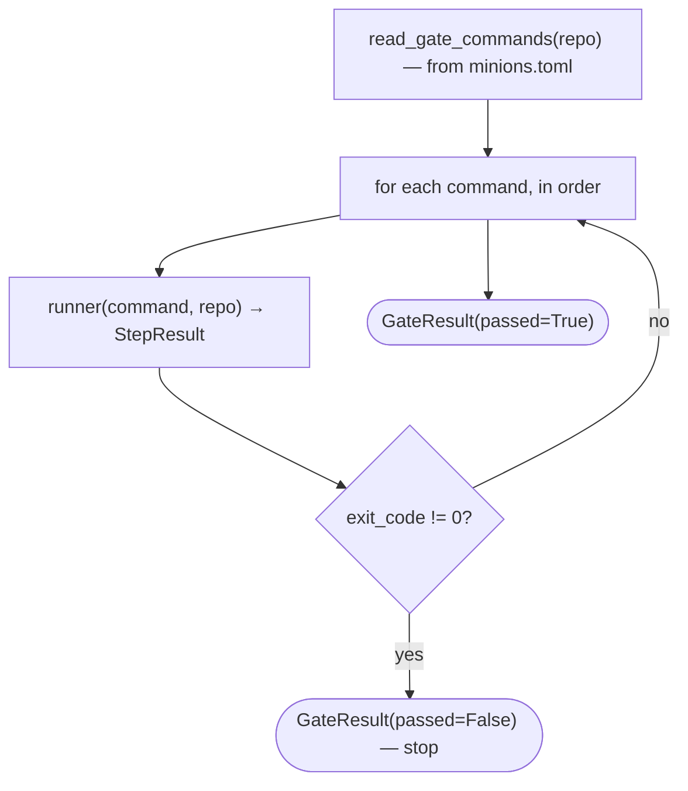

# `gate`

The orchestrator runs the **target repo's own** quality gate itself — so the agent it drives cannot game the
definition of done.

## What it does

Reads the target's ordered gate command list from its `minions.toml`, runs each command in order, and **stops
at the first failure**, returning a typed [`GateResult`](#gateresult). Like [`provider`](provider.md), it is a
seam ([`Gate`](#gate) Protocol) with a real adapter ([`SubprocessGate`](#subprocessgate)) and a scripted double
([`FakeGate`](#fakegate)).

## Boundaries

The gate does not *decide* what to do with a red result — it only reports pass/fail plus each step. The driver
([`decide`](driver.md#decide)) turns a red gate into a halt. The command list is **read from the target**, not
hardcoded, so a non-Python target needs no orchestrator change — only a different `minions.toml`.

## Data flow



## How clients use it

```python
gate = SubprocessGate()  # or FakeGate(preset) in tests
result = gate.run_gate(repo)
if not result.passed:
    ...  # the last step in result.steps is the one that went red
```

## Edge cases & invariants

- **Fail-fast**: `steps` is truncated at the first non-zero command — later commands never run.
- `run_command` uses `check=False` **on purpose** (opposite of the provider's `check=True`): a red gate is an
  *expected signal* to capture, not an exception to raise.
- Commands run via `shlex.split` + `subprocess.run` with **no shell**.
- `FakeGate` returns its preset verdict by identity and runs nothing.

## Reference

### `StepResult`

```python
@dataclass(frozen=True)
class StepResult:
    command: str
    exit_code: int  # 0 = pass
    output: str  # combined stdout + stderr, for the halt report
```

One gate command's outcome.

- **Aggregated into** — [`GateResult.steps`](#gateresult).

### `GateResult`

```python
@dataclass(frozen=True)
class GateResult:
    passed: bool
    steps: tuple[StepResult, ...]  # truncated at the first failure
```

The gate's aggregate verdict.

- **Consumed by** — [`decide`](driver.md#decide) (halts on `passed=False`) and [`converge`](converge.md#converge) (halts on a red gate after a fix); the driver emits one `gate-step` event per step.

### `read_gate_commands`

```python
def read_gate_commands(repo: Path) -> list[str]
```

Read the ordered gate command list from `repo/minions.toml` (`tomllib`, the `gate` key).

- **Why** — language-neutrality: a JS target ships a different list, no orchestrator change.
- **Source** — [`gate.py`](../../orchestrator/gate.py) · **Tests** — [`test_gate.py`](../../tests/test_gate.py)

### `run_command`

```python
def run_command(command: str, repo: Path) -> StepResult
```

Run one gate command in `repo` via `shlex.split` + `subprocess.run(check=False)` (no shell).

- **Gotchas** — the one untested side effect (exercised only in the end-to-end dogfood run). `check=False` captures a non-zero exit as the gate's signal rather than raising.
- **Returns** — [`StepResult`](#stepresult)
- **Source** — [`gate.py`](../../orchestrator/gate.py)

### `CommandRunner`

```python
CommandRunner = Callable[[str, Path], StepResult]
```

The injected-executor type — what [`SubprocessGate`](#subprocessgate) calls per command. Injecting a scripted
runner is what makes the fail-fast loop unit-testable without spawning real tools.

### `Gate`

```python
class Gate(Protocol):
    def run_gate(self, repo: Path) -> GateResult: ...
```

The seam the driver depends on. Structural, like [`Provider`](provider.md#provider).

- **Implemented by** — [`SubprocessGate`](#subprocessgate) (real), [`FakeGate`](#fakegate) (test double).

### `SubprocessGate`

```python
class SubprocessGate:
    def __init__(self, runner: CommandRunner = run_command) -> None
    def run_gate(self, repo: Path) -> GateResult
```

The real gate: reads the commands, runs each via the injected `runner`, stops at the first non-zero step.

- **Gotchas** — `runner` defaults to the real [`run_command`](#run_command); tests inject a scripted [`CommandRunner`](#commandrunner) to exercise the fail-fast logic without real tools.
- **Source** — [`gate.py`](../../orchestrator/gate.py) · **Tests** — [`test_gate.py`](../../tests/test_gate.py)

### `FakeGate`

```python
class FakeGate:
    def __init__(self, result: GateResult) -> None
    def run_gate(self, repo: Path) -> GateResult
```

The scripted double: returns the preset [`GateResult`](#gateresult) by identity, ignoring the repo. Ships in the
package as the seam's reference double — what the driver's tests inject.

- **Source** — [`gate.py`](../../orchestrator/gate.py) · **Tests** — [`test_gate.py`](../../tests/test_gate.py)
