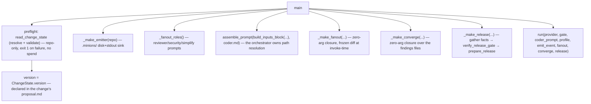

# `__main__`

The **composition root** — `python -m orchestrator run --repo <target> [--base <ref>] [--model <id>]`. It wires the *real*
adapters and the post-build closures into [`driver.run`](driver.md#run).

## What it does

[`main`](#main) runs a **zero-token preflight** — [`read_change_state`](state.md#read_change_state) to resolve +
validate the active change, which also yields the declared release version — that exits `1` with a diagnostic
before any spend; every refusal path in it raises, so no exception class escapes as a traceback. **The preflight
reads the repo and nothing else:** no `.env` is read, no directory outside the target is resolved, and the run
needs no permission grant beyond the repo it is pointed at. It then assembles the coder prompt from
[`build_inputs_block`](fanout.md#build_inputs_block) + [`assemble_prompt`](fanout.md#assemble_prompt), builds the
coder
[`Profile`](provider.md#profile), constructs [`ClaudeCodeProvider`](provider.md#claudecodeprovider) +
[`SubprocessGate`](gate.md#subprocessgate) + the status sink + the fan-out, converge, and release closures, calls
[`run`](driver.md#run), and exits `0` on `COMPLETE` / `1` on `HALTED`. Private `_make_*` helpers build the
closures the driver's seams expect; one status sink and one gate are shared across the run.

## Boundaries

This module is **deliberately untested** — it is the wiring, validated by running (a spy can't catch a missing
wire). No logic lives here that isn't exercised by the seams it composes; the interesting behaviour is in the
modules it imports.

## Data flow



## How clients use it

```console
$ python -m orchestrator run --repo /path/to/target
▶ phase P1 — building
  coder spawned — running…
  ...
■ complete — 3 phase(s) advanced
```

## Edge cases & invariants

- The coder profile is the one build-capable profile in the system: `allowed_tools=("Edit", "Write", "Bash")`.
- `_make_emitter` creates `<repo>/.minions/`, **truncates `events.jsonl`** (a fresh log per run), and returns
  the `(event) -> None` sink.
- The fan-out closure computes the **frozen diff at invoke-time** (`compute_diff(repo, args.base, "HEAD")`,
  where `--base` defaults to `main`), not at bind time — the final `HEAD` doesn't exist until the build
  finishes.
- The converge closure reads the same three findings files fan-out wrote and re-verifies each round over the
  scoped `head..HEAD` diff — the two stages communicate through disk, not return values.
- The release closure gathers the facts for the **pure** [`verify_release_gate`](release.md#verify_release_gate)
  (`gate.run_gate`, the three findings, [`deferred_work_text`](release.md#deferred_work_text) +
  `CHANGELOG.md` text, `_git_tags`, `_tree_is_clean`), then
  [`prepare_release`](release.md#prepare_release)s with a real [`SubprocessReleaseGit`](release.md#releasegit) and
  prints the handoff — `_current_branch` and `date.today()` supply the branch and date.
- All three closures are invoked by [`run`](driver.md#run) **only at plan-complete**; a halted build reaches none.
- A higher-order gotcha: each seam is passed the *built closure* (`fanout=_make_fanout(...)`), not the factory.
- `.minions/` is the target's per-run artifact dir and the **only** place a run writes outside the tracked
  tree it builds: `findings/`, `HALT.md`, `<version>_backlog.md`, `diff.patch`, `events.jsonl`, `status.json`
  (git-ignore it in the target, keeping `minions.toml`).

## Reference

### `main`

```python
def main(argv: list[str] | None = None) -> int
```

Parse `run --repo <target> [--base <ref>] [--model <id>]`, wire the real adapters + the fan-out and converge closures into
[`run`](driver.md#run), print the outcome, and return a process exit code.

- **Returns** — `0` on [`RunStatus.COMPLETE`](driver.md#runstatus--runresult), `1` on `HALTED`.
- **Gotchas** — untested by design; validated by an end-to-end run against a real target.
- **Source** — [`__main__.py`](../../orchestrator/__main__.py)

### `emit_and_render`

```python
def emit_and_render(stream: Path, status: Path, event: Event) -> None
```

The status sink's body: record an event to disk ([`emit`](status.md#emit--read_status)) **and** print
[`render(event)`](status.md#render) live to stdout. `main` binds `stream`/`status` via `functools.partial` to
form the `(event) -> None` sink handed to `run`.

- **Source** — [`__main__.py`](../../orchestrator/__main__.py)
