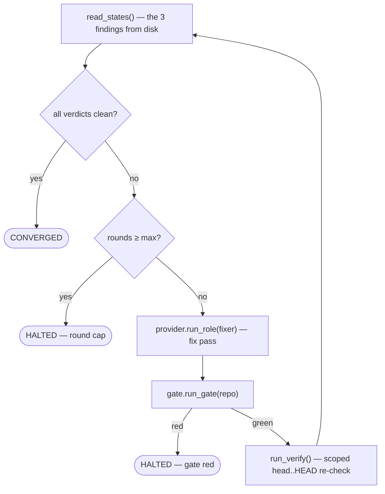

# Module reference — `orchestrator`

The current public API of the `orchestrator` package: all v0.1 modules (P2–P5) **plus** the v0.2 **P1**
status/event stream (`status.py`, and the `emit_event` seam threaded through `driver.run`), **P2** diff
supply + the read-only role profile (`diff.py`, `read_only_profile`), **P3** the findings-file reader
(`findings.py`), and **P4** the end-of-plan fan-out (`fanout.py`, and the `fanout` seam on `driver.run`).
Signatures below mirror the code; the docstrings in the source remain the authoritative "what each unit
does".

---

## `orchestrator/__init__.py`

The package marker. Currently holds one trivial smoke keeper from P1 (it proves import wiring + the gate;
it will be superseded as real modules are re-exported here).

| Symbol | Signature | Purpose |
| --- | --- | --- |
| `describe` | `describe() -> str` | Return a one-line description of the orchestrator (`"MinionsFactory orchestrator"`). |

---

## `orchestrator/provider.py` — the provider seam

Invoke a role as a fresh headless instance and parse its result. The driver depends on the **`Provider`
Protocol** here, never on the `claude` CLI directly.

### `RoleResult` — the typed CLI result (Pydantic `BaseModel`)

Parsed from `claude -p --output-format json`. Unknown fields in the CLI output are **ignored** (robust to
CLI version drift).

| Field | Type | Notes |
| --- | --- | --- |
| `subtype` | `str` | e.g. `"success"` |
| `is_error` | `bool` | the hard success/failure signal |
| `result` | `str` | the model's final text |
| `session_id` | `str` | for observability / later resume |
| `total_cost_usd` | `float` | cost accounting |
| `stop_reason` | `str \| None` | optional (defaults to `None`) |

### `parse_result`

```python
parse_result(stdout: str) -> RoleResult
```

Pure. Parses + validates a headless JSON string into a `RoleResult`
(`RoleResult.model_validate_json(stdout)`). Unit-tested.

### `Profile` — permission profile (frozen `dataclass`)

Internal config (constructed by us, not parsed at a boundary → a plain dataclass, not Pydantic).

| Field | Type | Default |
| --- | --- | --- |
| `permission_mode` | `str` | `"default"` |
| `allowed_tools` | `tuple[str, ...]` | `()` |
| `disallowed_tools` | `tuple[str, ...]` | `()` |

### `read_only_profile` — the read-only role factory (v0.2 P2)

```python
read_only_profile(findings_file: Path) -> Profile
```

The permission profile for a **read-only** role (review / security / simplify): denies `Bash` and `Edit`
(bare-tool denies — the *sound* regime per the Q1 finding: bare/coarse denies enforce, only fine-grained
`Bash` sub-patterns leak), and allows `Write` **only** to the role's single findings file
(`Write(<findings_file>)`). No dataclass change — it's a particular `Profile`, so `build_command` emits it
unchanged. Deliberately **not** a bare-`Write` deny: deny-precedence would override the scoped allow, so the
boundary is expressed as *allow-only-`Write(findings)`* + headless-deny-by-default for any other write. A
factory (not a subclass) — consistent with the frozen-dataclass, no-inheritance style. `Bash` denied is
*why* the role can't `git diff` itself → the orchestrator supplies the diff (`diff.py`).

### `Provider` — the seam (`typing.Protocol`)

```python
class Provider(Protocol):
    def run_role(
        self, role_prompt: str, repo: Path, profile: Profile
    ) -> RoleResult: ...
```

Any class with a matching `run_role` **is** a `Provider` (structural typing — no inheritance required).
`ty` enforces conformance at the point the driver declares `provider: Provider`.

### `build_command`

```python
build_command(role_prompt: str, profile: Profile) -> list[str]
```

Pure. Assembles the `claude -p` argv: `claude -p <prompt> --output-format json --permission-mode <mode>`,
appending `--allowedTools <…>` / `--disallowedTools <…>` only when the profile carries them. Returns a
**list** (each element one argument) — the argv is later passed to `subprocess.run` **without a shell**,
so a dynamic prompt can't inject commands. Unit-tested.

### `ClaudeCodeProvider` — the real adapter

```python
class ClaudeCodeProvider:
    def run_role(self, role_prompt: str, repo: Path, profile: Profile) -> RoleResult
```

`build_command` → `subprocess.run(argv, cwd=repo, capture_output=True, text=True, check=True)` →
`parse_result(stdout)`. The `subprocess.run` call is the one untestable side effect (exercised only in
the P6 dogfood). `check=True` means a non-zero exit raises `CalledProcessError` — the driver will decide
how to treat that; P6 may refine it.

### `FakeProvider` — the scripted test double

```python
class FakeProvider:
    def __init__(self, result: RoleResult) -> None
    def run_role(self, role_prompt: str, repo: Path, profile: Profile) -> RoleResult
```

Returns the preset `RoleResult` (by identity), ignoring its arguments; spawns nothing. Satisfies
`Provider` structurally. Ships in the package (not `tests/`) as the seam's reference double — this is
what the driver's unit tests inject.

---

## `orchestrator/gate.py` — the gate runner

The orchestrator runs the **target repo's own** quality gate itself (un-gameable) and returns a typed
verdict. The driver depends on the **`Gate` Protocol** here.

### `StepResult` — one command's outcome (frozen `dataclass`)

| Field | Type | Notes |
| --- | --- | --- |
| `command` | `str` | the gate command as written in `minions.toml` |
| `exit_code` | `int` | `0` = pass |
| `output` | `str` | combined stdout + stderr (for the halt report) |

### `GateResult` — the aggregate verdict (frozen `dataclass`)

| Field | Type | Notes |
| --- | --- | --- |
| `passed` | `bool` | all steps green |
| `steps` | `tuple[StepResult, ...]` | steps actually run — truncated at the first failure |

### `read_gate_commands`

```python
read_gate_commands(repo: Path) -> list[str]
```

Read the ordered gate command list from `repo/minions.toml` (`tomllib`). Language-neutral: a JS target
ships a different list, no orchestrator change. Unit-tested.

### `run_command`

```python
run_command(command: str, repo: Path) -> StepResult
```

Run one gate command in `repo` via `shlex.split` + `subprocess.run(check=False)` (no shell). `check=False`
is deliberate — a non-zero exit is the gate's *signal*, captured into `StepResult`, not an exception. The
one untested side effect (exercised only in the P6 dogfood).

### `CommandRunner` — the injected-executor type

```python
CommandRunner = Callable[[str, Path], StepResult]
```

### `Gate` — the seam (`typing.Protocol`)

```python
class Gate(Protocol):
    def run_gate(self, repo: Path) -> GateResult: ...
```

### `SubprocessGate` — the real gate

```python
class SubprocessGate:
    def __init__(self, runner: CommandRunner = run_command) -> None
    def run_gate(self, repo: Path) -> GateResult
```

Reads the commands, runs each via the injected `runner` (defaults to the real `run_command`), and
**stops at the first non-zero step**. The `runner` injection is what lets the fail-fast logic be
unit-tested without spawning real tools.

### `FakeGate` — the scripted test double

```python
class FakeGate:
    def __init__(self, result: GateResult) -> None
    def run_gate(self, repo: Path) -> GateResult
```

Returns the preset `GateResult` (by identity), ignoring the repo; runs nothing. Satisfies `Gate`
structurally. Ships in the package as the seam's reference double — what the driver's tests inject.

---

## `orchestrator/state.py` — the plan-state reader

Reconstructs "where are we" **purely from disk** — the driver reads this before and after each phase to
detect advance.

### `PlanState` — where-are-we (frozen `dataclass`)

| Field | Type | Notes |
| --- | --- | --- |
| `current_phase` | `str` | the plan's free-form phase pointer (frontmatter) |
| `phases` | `dict[str, str]` | `phase0…phaseN` → `done`/`planned` |
| `head` | `str` | the target repo's git HEAD sha |

### `select_plan`

```python
select_plan(vault_project_dir: Path) -> Path
```

Return the **highest-version** `vX.Y_*implementation_plan.md` under `implementation_plans/`, **ignoring
`archive/`**. Uses a shallow `glob` (never descends into `archive/`) and compares versions as `(int, int)`
tuples (so `v0.10 > v0.2`). Unit-tested.

### `parse_frontmatter`

```python
parse_frontmatter(text: str) -> dict[str, str]
```

Parse the plan's leading `---`-fenced YAML frontmatter into flat `key -> str` values — a small, stdlib-only
extractor (no YAML dependency) for our known, flat keys. Splits each line on the **first** `:`
(`str.partition`), stops at the closing fence. Unit-tested.

### `read_head`

```python
read_head(repo: Path) -> str
```

Return the target repo's git HEAD sha via `git rev-parse HEAD` (list-argv, no shell). The one untested
side effect (exercised in the P6 dogfood).

### `read_plan_state`

```python
read_plan_state(vault_project_dir: Path, repo: Path, head_reader: Callable[[Path], str] = read_head) -> PlanState
```

Compose `select_plan` → `parse_frontmatter` → git head into a `PlanState`. The injectable `head_reader`
(defaults to `read_head`) lets the composition be unit-tested **without spawning git**.

---

## `orchestrator/driver.py` — the build-spine loop

The deterministic driver — **no LLM** — that advances the plan or halts. The verdict is a pure function;
the loop is thin orchestration over the seams.

### `Decision` — one phase's verdict (frozen `dataclass`)

| Field | Type | Notes |
| --- | --- | --- |
| `advance` | `bool` | continue to the next phase, or halt |
| `reason` | `str` | halt reason when `advance` is `False`; `""` otherwise |

### `decide`

```python
decide(before: PlanState, after: PlanState, gate_result: GateResult, coder_halted: bool) -> Decision
```

Pure verdict. Precedence: **halt-report → red-gate → non-advance → advance**, where advance requires **both**
a new commit (`head` changed) **and** a moved `current_phase`. Unit-tested (the whole matrix).

### `RunStatus` / `RunResult`

`RunStatus` is `COMPLETE | HALTED`. `RunResult` (frozen `dataclass`) carries `status`, `reason`, and
`phases_advanced`.

### `run`

```python
run(repo, vault_project_dir, provider, gate, coder_prompt, profile,
    state_reader=read_plan_state, halt_checker=halt_report_exists,
    emit_event=_no_emit, fanout=_no_fanout, max_phases=100) -> RunResult
```

The loop: read `PlanState` → `provider.run_role(...)` → `halt_checker` → `gate.run_gate` → read state
again → `decide` → continue or halt. `state_reader`/`halt_checker` are injected seams (real defaults), so
the full matrix — including **resume** — is unit-tested behind `FakeProvider` + `FakeGate`. `max_phases`
is a runaway guard. `halt_report_exists` is the thin IO helper that checks the vault for the coder's HALT
report.

**v0.2 P1 — `emit_event`.** The loop is instrumented: it emits typed status events around each observation
(`phase-start` → `role-spawn` → `role-returned` → `gate-step`* → `advance`/`halt` → `run-summary`).
`emit_event: Callable[[Event], None]` is an injected sink defaulting to `_no_emit` (a no-op — a run without
an observer is valid), so the six v0.1 tests are unaffected and the instrumentation tests inject a spy
(`events.append`). Two nuances the tests pin: `provider.run_role(...)`'s return is now **captured** to
build the `role-returned` event but is **still discarded by `decide`** (surfaced for observation, never
trusted for the verdict); and every terminal path — complete, decision-halt, and the runaway guard — emits
a `run-summary` (both halt paths emit `halt` then `run-summary`).

**v0.2 P4 — `fanout`.** A second injected seam `fanout: Callable[[], list[FindingsState | None]] = _no_fanout`
is invoked **once, at plan-complete** (after the build loop, before the final `run-summary`) — so a halted
build never fans out. The default is a no-op (a build-only run is valid). Unit-tested: fan-out fires on
completion, not on halt.

---

## `orchestrator/status.py` — the status/event stream (v0.2 P1 · P4)

Makes a run **observable** without an LLM: the orchestrator writes typed, timestamped events to disk and a
renderer projects them to stdout. Observability is a **projection of on-disk state, not `print`** — a
projection is resumable + machine-readable (the future UI reads the same schema); a `print` is neither.
Also the home of `_no_emit` (the no-op sink) — moved here in P4 so both `driver.py` and `fanout.py` import
it without a cycle.

### `Event` — a discriminated union of per-event models (Pydantic)

Seven `BaseModel` variants, tagged by a `kind` `Literal`, under `Event = Annotated[… , Field(discriminator="kind")]`:

| Variant (`kind`) | Carries (beyond `ts: AwareDatetime`) | Emitted when |
| --- | --- | --- |
| `PhaseStart` (`phase-start`) | `phase` | a phase begins |
| `RoleSpawn` (`role-spawn`) | `role` | any role is spawned (result not yet landed) |
| `RoleReturned` (`role-returned`) | `role`, `session_id`, `total_cost_usd`, `is_error` | a role returns (fields off `RoleResult`) |
| `GateStep` (`gate-step`) | `command`, `passed` | per gate command run (one event each) |
| `Advance` (`advance`) | `from_phase`, `to_phase` | a phase advanced |
| `Halt` (`halt`) | `reason` | the run halts |
| `RunSummary` (`run-summary`) | `status` (`complete`/`halted`), `phases_advanced`, `reason` | the run ends (always last) |

`ts` is `AwareDatetime` (a naive datetime is **rejected** at the boundary, not silently stored). Parsing a
union needs a `TypeAdapter(Event)` (the alias is not a class) — the `kind` discriminator picks the variant.

**v0.2 P4 — role events unified.** `role` is a `Role = Literal["coder", "review", "security", "simplify"]`
alias (one source of truth, reused by `fanout.RoleSpec.name`). The old coder-specific `CoderSpawn`/
`CoderResult` were replaced by the generic `RoleSpawn`/`RoleReturned` (the coder is just `role="coder"`) —
so the fan-out roles reuse the same spawn/returned events instead of a parallel pair (avoiding the very
"dual paths" smell `simplify` flags). *(The result event is `RoleReturned`, not `RoleResult`, to avoid a
name clash with `provider.RoleResult`, the parsed CLI result.)*

### `append_event` / `read_events` — the append-only history (`events.jsonl`)

```python
append_event(stream: Path, event: Event) -> None      # one JSON line, mode "a"
read_events(stream: Path) -> list[Event]              # each line → its typed variant
```

JSONL (one event per line) so appends are cheap and crash-safe; the whole file is *not* one JSON document.

### `emit` / `read_status` — the current-state snapshot (`status.json`)

```python
emit(stream: Path, status: Path, event: Event) -> None   # append to history AND overwrite the snapshot
read_status(status: Path) -> Event                       # the latest event only
```

`emit` couples the two writes so the snapshot can't drift from the log. The snapshot is a **materialized
view** (the log is the source of truth; the snapshot is the O(1) "where are we now" read). *Scope: the
snapshot still holds the last event only; enriching it to `{stage, phase, last_event}` remains a deferred
refinement (per-role observability already comes from the `role` field on the events).*

### `render` — the pure per-event projection to a stdout line

```python
render(event: Event) -> str
```

A total function: a `match` with a `case` per variant and **no `case _`**, so `ty` enforces exhaustiveness
(add an 8th event → the type check goes red until it's rendered). Pure → unit-tested by asserting literal
lines.

### `is_in_progress` — "is a role still running?", derived from the snapshot

```python
is_in_progress(status: Path) -> bool     # True iff the snapshot's last event is a spawn
```

The in-progress indicator falls out of the snapshot for free: a dangling `role-spawn` (no `role-returned`
yet) *is* "running". Since P4 unified to `RoleSpawn`, this now covers *every* role (coder + fan-out) with
one `case RoleSpawn()`.

---

## `orchestrator/diff.py` — diff supply (v0.2 P2)

Computes the diff the orchestrator hands to a read-only role, and injects it as a **file** (not in the
prompt). A read-only role has no `Bash`, so it can't `git diff` itself — the orchestrator supplies it.

### `compute_diff`

```python
compute_diff(repo, base, head, runner=_run_git) -> str
```

Returns the diff for **`base..head`** — list-argv git (`["git", "diff", f"{base}..{head}"]`), no shell.
Two scopes serve two callers: **frozen `base..HEAD`** (the whole feature) for fan-out (P4), and
**`head..HEAD`** (just the fix) for re-verify (P5) — scoping re-verify to the fix is what makes the
converge loop shrink and terminate. The `runner: Callable[[list[str], Path], str]` is the injected seam
(same pattern as the gate); the real `_run_git` (`subprocess.run(..., cwd=repo, check=True)`) is the
untested subprocess edge. `check=True` (like the provider, unlike the gate): a failing `git diff` is an
error to surface, not a signal to capture.

### `run_role_with_diff`

```python
run_role_with_diff(provider, role_prompt, repo, profile, diff, diff_path) -> RoleResult
```

Writes `diff` to `diff_path` (under the target's `.minions/`; `mkdir(parents=True, exist_ok=True)` so it
doesn't depend on the emitter having run), then runs the role via the provider — the prompt carries only
the *path*, so a large diff never bloats it. **Role-agnostic on purpose**: it's the primitive the P4
fan-out composes per role (review / security / simplify differ only in prompt + findings file). Unit-tested
behind `FakeProvider` (file written + role ran); no real `claude`.

---

## `orchestrator/findings.py` — the findings-file reader (v0.2 P3)

Reads a role's findings file into a typed, validated **convergence verdict** — purely from disk. This is
**principle 2 made concrete**: the orchestrator decides "are we done?" from `verdict`/`open_blocking` in
*this file*, never from what a fixer *claims*. The fields are owned by the **verify pass** (the fixer only
flips a finding `open → fixed`), so the signal can't be gamed.

### `FindingsState` — the verdict (Pydantic `BaseModel`, frozen)

| Field | Type | Notes |
| --- | --- | --- |
| `verdict` | `Literal["clean", "changes-requested"]` | closed set — a typo'd verdict is **rejected** at read |
| `open_blocking` | `int` | coerced from the frontmatter string |
| `round` | `int` | coerced |
| `head` | `str` | the short SHA the pass reviewed (→ next re-verify scopes to `head..HEAD`) |

**Pydantic, not a dataclass** (unlike its sibling `PlanState`): the findings file is a trust boundary
*with structure worth enforcing* — ints to coerce and a closed `verdict` to validate. That's the refined
rule — *Pydantic when boundary data needs validating*, not merely "boundary → Pydantic" (`PlanState` reads
a boundary too but its pass-through strings need neither, so a dataclass suffices).

### `read_findings_state`

```python
read_findings_state(path: Path) -> FindingsState | None
```

Reuses `parse_frontmatter` from `state.py` (**no new parser**) and `model_validate`s the resulting dict —
Pydantic coerces the ints, ignores the extra frontmatter keys (`type`/`plan`/`branch`/…), and validates
`verdict`. A **missing file → `None`** (a not-yet-run role, not a crash), which keeps `verdict` a strict
`Literal` and makes `ty` force the converge loop to handle "not run" explicitly. Fully unit-tested (parse +
coercion, `None` on missing, `ValidationError` on an unknown verdict).

---

## `orchestrator/fanout.py` — the end-of-plan fan-out (v0.2 P4)

Runs the three read-only roles (review ‖ security ‖ simplify) over the frozen diff — the driver's first
post-build node. Pure **composition** of P1–P3: it invents no mechanism, it orchestrates the seams.

### `RoleSpec` — one fan-out role (frozen `dataclass`)

| Field | Type | Notes |
| --- | --- | --- |
| `name` | `Role` (`Literal[...]`) | → findings filename `${VERSION}_{name}.md` (and the `role-spawn` label) |
| `prompt` | `str` | the role's prompt text |

### `run_fanout`

```python
run_fanout(provider, repo, vault_dir, version, diff, diff_path, roles,
           emit_event=_no_emit) -> list[FindingsState | None]
```

**Sequential** (a plain loop — the `‖` is deterministic-simplest sequential; parallel is a noted-not-built
optimization) and **data-driven** (one loop over a `RoleSpec` table, *not* three near-identical functions —
which would be the "overlapping paths" smell `simplify` exists to catch). Per role: build
`read_only_profile(findings_file)` (P2) → `emit RoleSpawn` → `run_role_with_diff` (P2, diff injected as a
file) → `emit RoleReturned` → `read_findings_state` (P3) → collect. The `diff` is passed *in* (the caller
freezes `base..HEAD` once), so `run_fanout` needs no git and is fully unit-tested behind a recording
`FakeProvider` (three read-only spawns over the frozen diff; per-role events; verdicts collected). Wired
into `driver.run()` via the `fanout` seam; **its first live run — including `simplify.md`'s first execution
ever — is the P4 dogfood** (pending).

---

## `orchestrator/converge.py` — the converge loop

Drives open **blocking** review findings to clean by looping *fix → gate → re-verify*, or halts. No LLM in
the loop — control flow over on-disk state.



### `ConvergeStatus`

```python
class ConvergeStatus(Enum):  # CONVERGED | HALTED
```

The two ways a converge run ends. The driver branches on it.

### `ConvergeResult`

```python
@dataclass(frozen=True)
class ConvergeResult:
    status: ConvergeStatus
    reason: str  # "" when converged
    rounds: int
```

A converge run's outcome. Consumed by the driver — `HALTED` halts the whole run.

### `converge`

```python
converge(provider, gate, repo, fixer_prompt, coder_profile,
         read_states, run_verify, emit_event=_no_emit, max_rounds=3) -> ConvergeResult
```

**Does:** loops fix → gate → re-verify until every findings verdict is clean, else halts.
**Called by:** the driver, once, after fan-out.
**Needs:** `read_states` (the three findings, from disk), `run_verify` (the scoped re-check), `provider` + `gate` (spawn the fixer, run the gate).
**Watch:** re-reads `read_states` **every** round (state changes on disk between rounds); the fixer's return is **discarded** — convergence is read from disk; halts at `rounds ≥ max_rounds` or a red gate after a fix.

---

## `orchestrator/__main__.py` — the run-from-source entry

The **composition root** — wires the *real* `ClaudeCodeProvider` + `SubprocessGate` into `run()`.
Deliberately untested (you validate it by running it; that's P6).

```
python -m orchestrator run --repo <target>
```

Resolves the target's vault from its `.env` (`VAULT_PROJECT_DIR`), loads the coder prompt, builds the
coder `Profile` (Edit/Write/Bash), calls `run`, and exits `0` on COMPLETE / `1` on HALT.

**v0.2 P1 — the live status sink.** `_make_emitter(repo)` creates `<repo>/.minions/`, truncates
`events.jsonl` (a fresh log per run), and returns `partial(emit_and_render, stream, status)` — the
`(event) -> None` sink passed as `run(..., emit_event=...)`. `emit_and_render` writes each event to disk
(`emit`) **and** prints `render(event)` to stdout, so a live run finally speaks. `.minions/` is the
target's per-run artifact dir (git-ignore it in the target; see the backlog for the `minions.toml`
consolidation). Still untested — the wiring is validated by running (a spy can't catch a missing wire).

**v0.2 P4 — the fan-out closure.** `_make_fanout(...)` returns a **zero-arg closure** bound with the
provider, roles, base, and version; `run(..., fanout=...)` invokes it at plan-complete. The closure
computes the **frozen diff at invoke-time** (`compute_diff(repo, base, "HEAD")`) — *not* at bind time,
because the final `HEAD` doesn't exist until the build finishes. Supporting helpers: `_fanout_roles()`
loads the three prompts (`reviewer.md`/`security.md`/`simplify.md` → `RoleSpec`s), `_plan_version(vault)`
derives `vX.Y` from the plan filename, and a `--base` CLI arg (default `main`) sets the diff base. A
higher-order-function gotcha to remember: pass `fanout=_make_fanout(...)` (the built closure), not
`fanout=_make_fanout` (the factory).

---

_v0.1 modules built (P2–P5) + v0.2 **P1** (`status.py` + instrumented `run`) + **P2** (`diff.py` +
`read_only_profile`) + **P3** (`findings.py`) + **P4 code** (`fanout.py` + the driver `fanout` seam;
**dogfood pending**). Next: the **P4 dogfood** (first live `simplify.md` on a real branch), then **P5** —
the converge loop._
