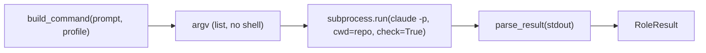

# `provider`

The seam the driver spawns roles through: run one role as a fresh headless instance, get back a typed result.

## What it does

Defines the [`Provider`](#provider) Protocol — one method, `run_role` — and two adapters that satisfy it: the
real [`ClaudeCodeProvider`](#claudecodeprovider) (spawns `claude -p`) and a scripted [`FakeProvider`](#fakeprovider)
(spawns nothing). Command assembly and JSON parsing are split into pure helpers so everything that can be
*wrong* is unit-testable without spawning a process.

## Boundaries

The provider does not decide *what* a role does (that is the role prompt) or *what it may touch* (that is the
[`Profile`](#profile)); it only runs the role and returns its result. It does not run the gate — the
orchestrator owns that ([`gate`](gate.md)).

## Data flow

The real adapter is an **invoke/parse split**: the outer two moves are pure; the middle one is the only side
effect.



## How clients use it

```python
provider = ClaudeCodeProvider(
    model="claude-opus-4-8"
)  # or FakeProvider(preset) in tests
result = provider.run_role(coder_prompt, repo, coder_profile)
if result.is_error:
    ...  # the role failed
```

## Edge cases & invariants

- The argv is a **list**, never `shell=True` — a dynamic prompt cannot inject shell commands.
- `ClaudeCodeProvider` runs with `check=True`: a non-zero exit raises `CalledProcessError` (a spawn failure is
  an error to surface, unlike the gate's captured red).
- `RoleResult` **ignores unknown JSON fields**, so a CLI version that adds keys does not break parsing.
- `FakeProvider` returns its preset result **by identity** and ignores every argument — the driver's unit tests
  never spawn `claude`.

## Reference

### `RoleResult`

```python
class RoleResult(BaseModel):
    subtype: str
    is_error: bool
    result: str
    session_id: str
    total_cost_usd: float
    stop_reason: str | None = None
```

The parsed result of a headless role run. Pydantic because it parses untrusted subprocess JSON.

- **Why Pydantic** — it sits at a trust boundary (subprocess output); unknown fields are ignored for CLI-drift tolerance. Contrast [`Profile`](#profile), a plain dataclass built by us.
- **Consumed by** — [`driver.run`](driver.md#run) and [`converge`](converge.md#converge) for the `role-returned` event; `is_error` is the hard success/failure signal.

### `parse_result`

```python
def parse_result(stdout: str) -> RoleResult
```

Pure parse of a headless JSON string into a [`RoleResult`](#roleresult) (`model_validate_json`).

- **Source** — [`provider.py`](../../orchestrator/provider.py) · **Tests** — [`test_provider.py`](../../tests/test_provider.py)

### `Profile`

```python
@dataclass(frozen=True)
class Profile:
    permission_mode: str = "default"
    allowed_tools: tuple[str, ...] = ()
    disallowed_tools: tuple[str, ...] = ()
```

A role's permission profile (native Claude Code perms). Internal config we construct — a frozen dataclass, no
validation.

- **Consumed by** — [`build_command`](#build_command), which emits the `--permission-mode` / `--allowedTools` /
  `--disallowedTools` flags.

### `read_only_profile`

```python
def read_only_profile(findings_file: Path) -> Profile
```

The profile for a **read-only** role (review / security / simplify): denies `Bash` and `Edit`, allows `Write`
only to the role's own findings file.

- **Why** — a read-only role must not touch the repo; the one thing it may write is its verdict. (Rationale — bare-tool denies enforce, scoped `Bash` sub-patterns leak: the vault's `decisions.md` → read-only permission profile / Q1.)
- **Gotchas** — expressed as *allow-only-`Write(findings)`*, not a bare-`Write` deny: deny-precedence would override a scoped allow. `Bash` denied is *why* the role cannot `git diff` itself → the orchestrator supplies the diff ([`diff`](diff.md)).
- **Returns** — [`Profile`](#profile)
- **Called by** — [`run_fanout`](fanout.md#run_fanout), once per role.
- **Source** — [`provider.py`](../../orchestrator/provider.py) · **Tests** — [`test_provider.py`](../../tests/test_provider.py)

### `Provider`

```python
class Provider(Protocol):
    def run_role(
        self, role_prompt: str, repo: Path, profile: Profile
    ) -> RoleResult: ...
```

The seam the driver depends on. Any class with a matching `run_role` **is** a `Provider` — structural typing,
no inheritance.

- **Why structural, not an ABC** — an adapter for another harness (opencode, Codex) needs to import nothing of ours. (Rationale: the vault's `decisions.md` → provider seam / structural typing.)
- **Enforced by** — `ty`, statically, wherever a value flows into a `Provider`-typed slot; there is no runtime `isinstance`.
- **Implemented by** — [`ClaudeCodeProvider`](#claudecodeprovider) (real), [`FakeProvider`](#fakeprovider) (test double).

### `build_command`

```python
def build_command(
    role_prompt: str, profile: Profile, model: str | None = None, effort: str | None = None
) -> list[str]
```

Pure. Assembles the `claude -p … --output-format json --permission-mode <mode>` argv, appending `--model` /
`--effort` (when pinned), then `--allowedTools` / `--disallowedTools` only when the profile carries them.

- **Params** — `model`: pins every role to a specific model (e.g. `claude-opus-4-8`) · `effort`: reasoning effort `low|medium|high|xhigh|max`; each `None` → the `claude` CLI's own default.
- **Returns** — the argv as a **list** (one element per argument), later passed to `subprocess.run` without a shell.
- **Source** — [`provider.py`](../../orchestrator/provider.py) · **Tests** — [`test_provider.py`](../../tests/test_provider.py)

### `ClaudeCodeProvider`

```python
class ClaudeCodeProvider:
    def __init__(self, model: str | None = None, effort: str | None = None) -> None
    def run_role(self, role_prompt: str, repo: Path, profile: Profile) -> RoleResult
```

The real adapter: [`build_command`](#build_command) → `subprocess.run(argv, cwd=repo, check=True)` →
[`parse_result`](#parse_result). Constructed with an optional `model` + reasoning `effort` that pin every role's
`claude -p` run (wired from `__main__`'s `--model` / `--effort` flags); each `None` uses the CLI default.

- **Raises** — [`ProviderError`](#providererror) on a non-zero exit (it catches `CalledProcessError` and attaches the CLI's stderr tail), so the driver can halt cleanly rather than crash.
- **Gotchas** — the `subprocess.run` call is the one live side effect; the non-zero-exit → `ProviderError` branch *is* unit-tested (monkeypatched `subprocess.run`).
- **Source** — [`provider.py`](../../orchestrator/provider.py) · **Tests** — [`test_provider.py`](../../tests/test_provider.py)

### `ProviderError`

```python
class ProviderError(Exception):  # a headless claude -p role failed (non-zero exit)
```

Raised by [`ClaudeCodeProvider.run_role`](#claudecodeprovider) when `claude -p` exits non-zero — most often a
**subscription usage limit** or an API error. [`driver.run`](driver.md#run) catches it around the coder spawn and
turns it into a clean, resumable **halt** (a `halt` event + `HALTED` result, not a traceback); [`__main__`](main.md)
backstops the same error in the post-build stages.

### `FakeProvider`

```python
class FakeProvider:
    def __init__(self, result: RoleResult) -> None
    def run_role(self, role_prompt: str, repo: Path, profile: Profile) -> RoleResult
```

The scripted double: returns the preset [`RoleResult`](#roleresult) by identity, ignoring its arguments, and
spawns nothing. Satisfies [`Provider`](#provider) structurally and ships in the package as the seam's reference
double.

- **Used by** — the driver / fan-out / converge unit tests.
- **Source** — [`provider.py`](../../orchestrator/provider.py) · **Tests** — [`test_provider.py`](../../tests/test_provider.py)
