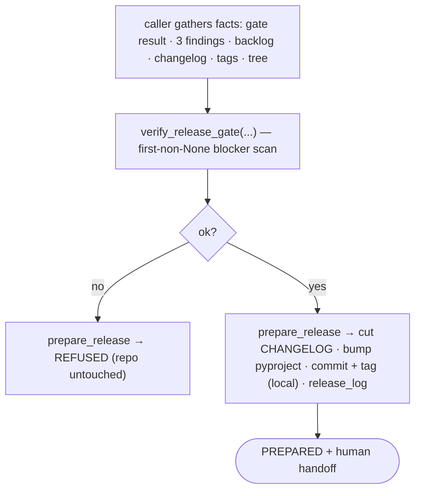

# `release`

Verify a branch is releasable, then prepare the release **locally** and hand off to the human — the run's last
deterministic stage.

## What it does

[`verify_release_gate`](#verify_release_gate) judges every release precondition (gate green · the three findings
`clean` · backlog current-release section closed · release tag free · CHANGELOG `[Unreleased]` non-empty · clean
tree) into a [`ReleaseVerdict`](#releaseverdict). On a green verdict, [`prepare_release`](#prepare_release) cuts
the CHANGELOG, bumps `pyproject`, commits + annotated-tags locally, and prepends the vault release log — then
returns the human merge+push handoff. **No LLM**: the `release.md` role is now pure control flow over disk.

## Boundaries

**The boundary never crosses.** `prepare_release` prepares *locally* and stops — push and merge are the human's
high-consequence, irreversible steps. This is **structural, not a runtime check**: the [`ReleaseGit`](#releasegit)
seam has no `push` or `merge`, so prepare *cannot* ship even by mistake.

[`verify_release_gate`](#verify_release_gate) is **pure** — it judges over facts the caller gathers (the
release-time analog of [`decide`](driver.md#decide)); it runs no gate and reads no files itself.

## Data flow



## How clients use it

```python
verdict = verify_release_gate(
    version="v0.2",
    gate_result=gate.run_gate(repo),
    findings=[read_findings_state(p) for p in findings_paths],
    backlog_text=(vault_dir / "backlog.md").read_text(),
    changelog_text=(repo / "CHANGELOG.md").read_text(),
    existing_tags=git_tags(repo),
    tree_is_clean=tree_is_clean(repo),
)
result = prepare_release(verdict, repo, vault_dir, "v0.2", today, branch, SubprocessReleaseGit())
if result.status is ReleaseStatus.PREPARED:
    print(result.handoff)  # git checkout main; merge; push — the human's turn
```

## Edge cases & invariants

- **Fail-closed predicates.** A missing backlog current-release section, or a missing/empty CHANGELOG
  `[Unreleased]`, **blocks** release — absence of evidence is not evidence of absence.
- **Refuse-on-red is a true no-op.** On a red verdict `prepare_release` writes nothing, commits nothing, tags
  nothing — the repo is byte-for-byte unchanged. verify gates prepare; the two never run concurrently.
- **The tag keeps the leading `v`** (`v0.2` → tag `v0.2.0`); the CHANGELOG heading + `pyproject` version drop it
  (`0.2.0`).
- **Cutting re-arms the interlock.** After `prepare_release`, the CHANGELOG `[Unreleased]` is empty again, so a
  *next* [`verify_release_gate`](#verify_release_gate) blocks until new entries land — you cannot cut twice.

## Reference

### `ReleaseVerdict`

```python
@dataclass(frozen=True)
class ReleaseVerdict:
    ok: bool
    reason: str  # "" when releasable; the first blocking reason otherwise
```

The release gate's verdict — releasable, or blocked with a readable reason.

- **Produced by** — [`verify_release_gate`](#verify_release_gate); consumed by [`prepare_release`](#prepare_release).

### `verify_release_gate`

```python
def verify_release_gate(
    version, gate_result, findings, backlog_text, changelog_text, existing_tags, tree_is_clean,
) -> ReleaseVerdict
```

Verify every release precondition; return `ok`, or the first blocking reason. **Pure** — the release-time analog
of [`decide`](driver.md#decide): it judges over already-gathered facts, so the whole gate is one first-non-`None`
scan over `str | None` blocker predicates.

- **Params** — `version`: e.g. `"v0.2"` → tag `v0.2.0` · [`gate_result`](gate.md#gateresult): the gate verdict (run by the caller) · [`findings`](findings.md#findingsstate): the three role verdicts (all must be `clean` — see [`all_findings_clean`](findings.md#all_findings_clean)) · `backlog_text`, `changelog_text`: the raw files · `existing_tags`: the repo's tags (tag must be free) · `tree_is_clean`: no uncommitted changes.
- **Returns** — [`ReleaseVerdict`](#releaseverdict): `ok=True`, or `ok=False` with the first reason.
- **Edge cases** — **fail-closed**: a missing backlog current-release section or a missing/empty `[Unreleased]` blocks release; a missing findings file (`None`) counts as not clean.
- **Gotchas** — takes `gate_result` (data), **not** the [`gate`](gate.md#gate) seam — it never runs the gate itself, unlike [`converge`](converge.md#converge).
- **Called by** — [`prepare_release`](#prepare_release)'s caller; composed in [`__main__`](main.md) by `_make_release`.
- **Source** — [`release.py`](../../orchestrator/release.py) · **Tests** — [`test_release.py`](../../tests/test_release.py)

### `ReleaseStatus`

```python
class ReleaseStatus(Enum):   # PREPARED | REFUSED
```

How release-prep ended: `PREPARED` (local commit + tag, awaiting the human) or `REFUSED` (a red verdict). The
[`driver`](driver.md#run) halts the run on `REFUSED`, completes it on `PREPARED`.

### `ReleaseResult`

```python
@dataclass(frozen=True)
class ReleaseResult:
    status: ReleaseStatus
    reason: str    # "" when prepared; the blocking reason when refused
    handoff: str   # merge+push instructions when prepared; "" when refused
```

The outcome of [`prepare_release`](#prepare_release).

- **Returned to** — [`driver.run`](driver.md#run) via the injected `release` seam; the handoff is printed by
  [`__main__`](main.md), never by the driver.

### `ReleaseGit`

```python
class ReleaseGit(Protocol):
    def commit_all(self, repo: Path, message: str) -> None: ...
    def tag(self, repo: Path, name: str, message: str) -> None: ...
```

The git operations release-prep needs — **and only those**. It has **no `push` or `merge`**: the "prepare
locally, the human ships" boundary is encoded in the seam's shape, not enforced at runtime. Implemented by the
real `SubprocessReleaseGit` (`git add -A` + `commit` + annotated `tag`, no shell, no push) and the recording
`FakeReleaseGit` (records commit messages + tag names, runs no git).

### `prepare_release`

```python
def prepare_release(verdict, repo, vault_dir, version, today, branch, git) -> ReleaseResult
```

Prepare the release on a green verdict, then hand off to the human; refuse on red.

- **Params** — [`verdict`](#releaseverdict): the gate result (refuse if not `ok`) · `repo`, `vault_dir`: the target repo + its vault · `version`, `today`, `branch`: the tag/date/branch woven into the CHANGELOG, tag, and handoff · [`git`](#releasegit): the commit + local-tag seam.
- **Returns** — [`ReleaseResult`](#releaseresult): `REFUSED` (repo untouched) or `PREPARED` (with the handoff).
- **Edge cases** — refuse-on-red is a **true no-op**: no file write, no commit, no tag. On green the order is cut/bump → commit → tag → release_log (the commit is the point of no return; the release-log prepend is re-runnable).
- **Gotchas** — never pushes or merges (the `git` seam can't); the tag keeps the leading `v` (`v0.2.0`) while the CHANGELOG/`pyproject` version drops it (`0.2.0`).
- **Called by** — [`driver.run`](driver.md#run) via the injected `release` seam (once, after `converge` converges); composed in [`__main__`](main.md) by `_make_release`.
- **Source** — [`release.py`](../../orchestrator/release.py) · **Tests** — [`test_release.py`](../../tests/test_release.py)
