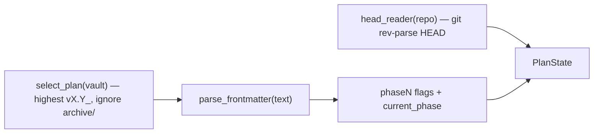

# `state`

Reconstruct **where the run stands** from disk alone — the highest-version plan's phase state plus the target
repo's git head. This is what makes resume free.

## What it does

[`read_plan_state`](#read_plan_state) selects the active plan ([`select_plan`](#select_plan)), reads its
frontmatter ([`parse_frontmatter`](#parse_frontmatter)) for `current_phase` + the `phaseN` flags, and pairs it
with the git head ([`read_head`](#read_head)) into a [`PlanState`](#planstate). The driver reads it before and
after each phase to **detect** advance.

## Boundaries

It reads state; it never writes it. It knows nothing about *why* a phase advanced — it only reports the two
facts (`current_phase`, `head`) the driver compares. Plan selection deliberately ignores `archive/` (completed
predecessors are historical record).

## Data flow



## How clients use it

```python
before = read_plan_state(vault_project_dir, repo)
#  ... run the coder + gate ...
after = read_plan_state(vault_project_dir, repo)
advanced = after.head != before.head and after.current_phase != before.current_phase
```

## Edge cases & invariants

- Plan selection compares versions as `(int, int)` tuples, so `v0.10 > v0.2` (not string order).
- `parse_frontmatter` is stdlib-only (no YAML dependency): it splits each line on the **first** `:` and stops at
  the closing `---` fence — sufficient for our flat, known keys.
- `read_head` is the one untested side effect; `read_plan_state`'s injectable `head_reader` lets the composition
  be tested without spawning git.

## Reference

### `PlanState`

```python
@dataclass(frozen=True)
class PlanState:
    current_phase: str  # the plan's free-form phase pointer (frontmatter)
    phases: dict[str, str]  # phase0…phaseN → "done" / "planned"
    head: str  # the target repo's git HEAD sha
```

Where-are-we, read from disk.

- **Why a dataclass, not Pydantic** — its fields are pass-through strings that need no coercion or validation (contrast [`FindingsState`](findings.md#findingsstate), which does). Pydantic where boundary data needs validating, not at every boundary.
- **Consumed by** — [`decide`](driver.md#decide) (compares `before` vs `after`) and [`driver.run`](driver.md#run) (plan-complete check reads `phases`).

### `select_plan`

```python
def select_plan(vault_project_dir: Path) -> Path
```

Return the **highest-version** `vX.Y_*implementation_plan.md` under `implementation_plans/`, ignoring
`archive/`.

- **Gotchas** — a shallow `glob` (never descends into `archive/`); version compared as `(int, int)` so `v0.10 > v0.2`.
- **Called by** — [`read_plan_state`](#read_plan_state); also [`__main__`](main.md) to derive the plan version for findings filenames.
- **Source** — [`state.py`](../../orchestrator/state.py) · **Tests** — [`test_state.py`](../../tests/test_state.py)

### `parse_frontmatter`

```python
def parse_frontmatter(text: str) -> dict[str, str]
```

Parse a plan's leading `---`-fenced YAML frontmatter into flat `key -> str` values — a small stdlib-only
extractor for our known, flat keys.

- **Gotchas** — splits on the **first** `:` (`str.partition`), strips surrounding quotes, stops at the closing fence; returns `{}` if the text does not start with `---`.
- **Reused by** — [`read_findings_state`](findings.md#read_findings_state) (no new parser for the findings file).
- **Source** — [`state.py`](../../orchestrator/state.py) · **Tests** — [`test_state.py`](../../tests/test_state.py)

### `read_head`

```python
def read_head(repo: Path) -> str
```

Return the target repo's git HEAD sha via `git rev-parse HEAD` (list-argv, no shell).

- **Gotchas** — the one untested side effect (exercised in the dogfood run).
- **Source** — [`state.py`](../../orchestrator/state.py)

### `read_plan_state`

```python
def read_plan_state(
    vault_project_dir: Path,
    repo: Path,
    head_reader: Callable[[Path], str] = read_head,
) -> PlanState
```

Compose [`select_plan`](#select_plan) → [`parse_frontmatter`](#parse_frontmatter) → git head into a
[`PlanState`](#planstate).

- **Params** — `head_reader`: the git-head seam (defaults to [`read_head`](#read_head)); tests inject a stub so the composition runs without git.
- **Returns** — [`PlanState`](#planstate)
- **Called by** — [`driver.run`](driver.md#run) via the injected `state_reader` seam.
- **Source** — [`state.py`](../../orchestrator/state.py) · **Tests** — [`test_state.py`](../../tests/test_state.py)
