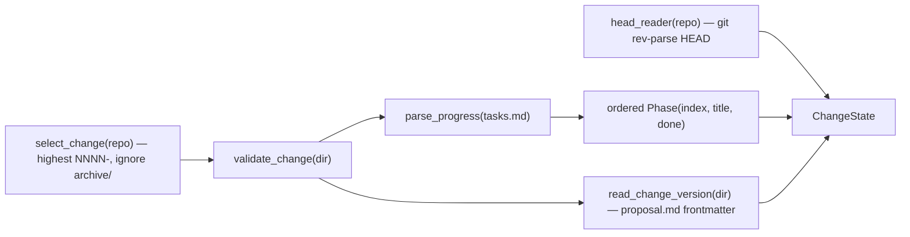

# `state`

Reconstruct **where the run stands** from disk alone — the active in-tree change's phase checklist plus the
target repo's git head. This is what makes resume free.

## What it does

[`read_change_state`](#read_change_state) resolves the active change ([`select_change`](#select_change)),
refuses a malformed one ([`validate_change`](#validate_change)), reads the release version its `proposal.md`
declares ([`read_change_version`](#read_change_version)), parses its `tasks.md` `## Progress` checklist into
ordered phases ([`parse_progress`](#parse_progress)), and pairs the lot with the git head
([`read_head`](#read_head)) into a [`ChangeState`](#changestate). The driver reads it before and after each
phase and asks [`change_advanced`](#change_advanced) whether the phase really moved — so advance is **detected**
from disk, never trusted from the agent.

It also owns the **read-side of the target contract**: the contract guards refuse a malformed change at read
time (a [`PlanContractError`](#plancontracterror)) — so a malformed target halts **before any spend**, not
obscurely mid-run. **The contract is now the repo and nothing but the repo:** this module reads no `.env`, and
resolves no directory outside the target.

## Boundaries

It reads state; it never writes it. It knows nothing about *why* a phase advanced — it only reports the two
facts (the current-phase index, `head`) the driver compares. Its only inputs are the **repo** and a git-head
seam, so it structurally cannot hop outside the repository. Change selection deliberately ignores
`openspec/changes/archive/` (shipped predecessors are historical record).

## Data flow



## How clients use it

```python
before = read_change_state(repo)
#  ... run the coder + gate ...
after = read_change_state(repo)
advanced = change_advanced(before, after)
```

## Edge cases & invariants

- Change selection compares the numeric id (`NNNN-<slug>`) as an `int`, so `0010 > 0002` (not string order).
- `parse_frontmatter` is stdlib-only (no YAML dependency): it splits each line on the **first** `:` and stops at
  the closing `---` fence — sufficient for our flat, known keys.
- `parse_progress` reads **only** the `## Progress` section, closing at the next `## ` heading, so a
  checkbox-shaped line under a phase's prose never leaks into the phase list.
- `read_head` is the one untested side effect; `read_change_state`'s injectable `head_reader` lets the
  composition be tested without spawning git.
- **Fail-closed contract checks.** The reader refuses a repo with no active change, a change missing one of its
  four artifacts, a `tasks.md` with no `## Progress` checklist (the *silent* case where a zero-phase change
  would otherwise read as already "complete"), and a `proposal.md` declaring no parseable `version`.
  It refuses a change id that is not `<digits>-<lowercase-slug>` — the id keys the findings path and reaches a
  role's write grant, so its shape is checked where it is read — anchored with `\A`/`\Z`, since Python's `$`
  also matches before a *trailing newline*, which is legal in a directory name. Every file the reader touches is
  read as UTF-8 and an undecodable one is refused with a diagnostic naming it — `UnicodeDecodeError` is another
  `ValueError` sibling, and `except OSError` does not catch it. Every one raises, never passes on doubt: no other
  exception class escapes the preflight.
- A change with **every** box ticked is complete (`ChangeState.is_complete`) — that is the loop's exit
  condition, and the trigger for the end-of-change fan-out.

## Reference

### `Phase`

```python
@dataclass(frozen=True)
class Phase:
    index: int  # the phase number from `- [ ] N — Title`
    title: str  # the phase title
    done: bool  # whether the checkbox is ticked
```

One ordered phase from a change's `tasks.md` `## Progress` checklist.

### `ChangeState`

```python
@dataclass(frozen=True)
class ChangeState:
    change_id: str  # the change dir name, e.g. "0005-change-cutover"
    phases: tuple[Phase, ...]  # ordered, from the tasks.md checklist
    head: str  # the target repo's git HEAD sha
    version: str  # the release version the proposal declares
```

Where-are-we, read from disk. Its properties are the advance cursor: `current` (the first unchecked phase, or
`None`), `current_index`, and `is_complete`.

- **Why a dataclass, not Pydantic** — its fields are pass-through values that need no coercion or validation
  (contrast [`FindingsState`](findings.md#findingsstate), which does). Pydantic where boundary data needs
  validating, not at every boundary.
- **Consumed by** — [`decide`](driver.md#decide) (compares `before` vs `after` via
  [`change_advanced`](#change_advanced)), [`driver.run`](driver.md#run) (loops on `is_complete`, labels events
  from `current`), and [`__main__`](main.md) (the release version comes from `version`).

### `select_change`

```python
def select_change(repo: Path) -> Path
```

Return the **active** change dir under `<repo>/openspec/changes/` — the highest numeric `NNNN-<slug>` id,
excluding `archive/`.

- **Raises** — [`PlanContractError`](#plancontracterror) naming the changes directory when no candidate exists,
  so an empty candidate set can never escape as a bare `ValueError` from `max()`; and naming the id when the
  selected dir is not `<digits>-<lowercase-slug>` — the id keys the findings path and is interpolated into the
  read-only role's `Write(<path>)` grant, so its shape is refused where it is read. The pattern is anchored
  `\A…\Z`, not `^…$`: `$` also matches immediately before a trailing newline, so `0009-evil\n` — a legal
  directory name — passed the `$` form and reached the grant.
- **Called by** — [`read_change_state`](#read_change_state); also [`__main__`](main.md) to resolve the change
  dir for the Inputs block and the findings key.
- **Source** — [`state.py`](../../orchestrator/state.py) · **Tests** — [`test_state.py`](../../tests/test_state.py)

### `validate_change`

```python
def validate_change(change_dir: Path) -> None
```

Raise [`PlanContractError`](#plancontracterror) if the change is missing any of its four artifacts —
`proposal.md`, `design.md`, `tasks.md`, `specs/`.

- **Called by** — [`read_change_state`](#read_change_state).
- **Source** — [`state.py`](../../orchestrator/state.py) · **Tests** — [`test_state.py`](../../tests/test_state.py)

### `read_change_version`

```python
def read_change_version(change_dir: Path) -> str
```

Return the release version the change declares as leading `version: vX.Y` frontmatter in its `proposal.md`.
The change is the unit of release, so the version travels with it.

- **Raises** — [`PlanContractError`](#plancontracterror) naming `proposal.md` and the `version` field when the
  frontmatter is absent, carries no `version` key, or carries a value that is not `vX.Y`.
- **Gotchas** — `vX.Y` exactly: no patch component. The git tag the release step cuts is `vX.Y.0`.
- **Called by** — [`read_change_state`](#read_change_state).
- **Source** — [`state.py`](../../orchestrator/state.py) · **Tests** — [`test_state.py`](../../tests/test_state.py)

### `parse_progress`

```python
def parse_progress(text: str) -> list[Phase]
```

Parse a `tasks.md` `## Progress` checklist (`- [ ] N — Title`) into ordered [`Phase`](#phase) entries; a ticked
box is `done`.

- **Gotchas** — opens at the `## Progress` heading and closes at the next `## ` heading, so checkbox-shaped
  lines elsewhere in the file are excluded.
- **Source** — [`state.py`](../../orchestrator/state.py) · **Tests** — [`test_state.py`](../../tests/test_state.py)

### `parse_frontmatter`

```python
def parse_frontmatter(text: str) -> dict[str, str]
```

Parse a document's leading `---`-fenced YAML frontmatter into flat `key -> str` values — a small stdlib-only
extractor for our known, flat keys.

- **Gotchas** — splits on the **first** `:` (`str.partition`), strips surrounding quotes, stops at the closing fence; returns `{}` if the text does not start with `---`.
- **Reused by** — [`read_change_version`](#read_change_version) and
  [`read_findings_state`](findings.md#read_findings_state) (no new parser per file shape).
- **Source** — [`state.py`](../../orchestrator/state.py) · **Tests** — [`test_state.py`](../../tests/test_state.py)

### `read_head`

```python
def read_head(repo: Path) -> str
```

Return the target repo's git HEAD sha via `git rev-parse HEAD` (list-argv, no shell).

- **Gotchas** — the one untested side effect (exercised in the dogfood run).
- **Source** — [`state.py`](../../orchestrator/state.py)

### `read_change_state`

```python
def read_change_state(
    repo: Path,
    head_reader: Callable[[Path], str] = read_head,
) -> ChangeState
```

Compose [`select_change`](#select_change) → [`validate_change`](#validate_change) →
[`read_change_version`](#read_change_version) → [`parse_progress`](#parse_progress) → git head into a
[`ChangeState`](#changestate).

- **Params** — `head_reader`: the git-head seam (defaults to [`read_head`](#read_head)); tests inject a stub so the composition runs without git.
- **Returns** — [`ChangeState`](#changestate)
- **Raises** — [`PlanContractError`](#plancontracterror) on any contract violation (no active change, a missing artifact, an artifact that is unreadable or not valid UTF-8, no `## Progress` checklist, no declared `version`).
- **Called by** — [`driver.run`](driver.md#run) via the injected `state_reader` seam; also directly in [`__main__`](main.md)'s preflight (to refuse a malformed change before spend).
- **Source** — [`state.py`](../../orchestrator/state.py) · **Tests** — [`test_state.py`](../../tests/test_state.py)

### `change_advanced`

```python
def change_advanced(before: ChangeState, after: ChangeState) -> bool
```

Whether the change advanced: a **new commit** landed **and** the current-phase index moved.

- **Why both** — a ticked checkbox is trusted only when a real commit proves it, so the agent the driver drives
  cannot game the advance.
- **Called by** — [`decide`](driver.md#decide), which delegates rather than re-implementing the test.
- **Source** — [`state.py`](../../orchestrator/state.py) · **Tests** — [`test_state.py`](../../tests/test_state.py)

### `PlanContractError`

```python
class PlanContractError(ValueError):  # a change breaks the execution contract
```

Raised by the change contract guards, and the **only** exception the preflight catches: every refusal a run
can hit before spend is a broken change contract. Caught in [`__main__`](main.md)'s preflight to print a clean
diagnostic and exit `1` — never a bare traceback mid-run.

- **Gotchas** — keeps its name although its subject is now a change; renaming it would touch every raise site
  and every `except` clause for no behavioural payoff.
