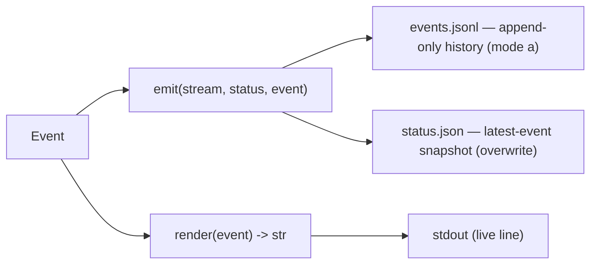

# `status`

Make a run **observable** without an LLM: the orchestrator writes typed, timestamped events to disk; a renderer
projects them to stdout.

## What it does

Defines the [`Event`](#event) discriminated union (seven variants), an append-only writer/reader for the
history (`events.jsonl`), a snapshot writer/reader (`status.json`), a pure [`render`](#render) to a stdout line,
and [`is_in_progress`](#is_in_progress) derived from the snapshot. Observability is a **projection of on-disk
state, not `print`** — a projection is resumable and machine-readable; a `print` is neither.

## Boundaries

The orchestrator *observes* roles from the outside and emits the events itself — a role never emits, so the
stream can't be gamed (same posture as the orchestrator-run gate). This module owns the schema + IO only; the
driver, fan-out, and converge decide *when* to emit. The status stream is a side-channel: the driver's logic
never depends on whether anyone is listening (the sink defaults to a no-op).

## Data flow

Every event is both **appended** to the history and **overwritten** into the snapshot, then rendered:



## How clients use it

```python
# the composition root couples emit + render into one sink:
def emit_and_render(stream, status, event):
    emit(stream, status, event)
    print(render(event))


run(..., emit_event=partial(emit_and_render, stream, status))
```

## Edge cases & invariants

- The history is **JSONL** — one event per line, so appends are cheap and crash-safe; the whole file is *not*
  one JSON document (`read_events` parses line by line).
- `emit` couples the two writes so the snapshot can never drift from the log.
- `ts` is an `AwareDatetime`: a naive datetime is **rejected** at the boundary, not silently stored.
- `render` is a total `match` with **no `case _`** — adding an eighth event variant turns the type check red
  until it is rendered.
- The snapshot currently persists the **latest event** only; the richer [`Status`](#status) shape
  (`stage`/`phase`/`last_event`) is defined but not yet populated by the write path (per-role observability
  already comes from the event's `role` field).

## Reference

### `Event`

```python
Role = Literal["coder", "review", "security", "simplify"]

Event = Annotated[
    PhaseStart | RoleSpawn | RoleReturned | GateStep | Advance | Halt | RunSummary,
    Field(discriminator="kind"),
]
```

A discriminated union of seven Pydantic `BaseModel` variants, tagged by a `kind` `Literal`. Every variant
carries `ts: AwareDatetime`; the extra fields and emit trigger per variant:

| Variant (`kind`) | Extra fields | Emitted when |
| --- | --- | --- |
| `PhaseStart` (`phase-start`) | `phase` | a phase begins |
| `RoleSpawn` (`role-spawn`) | `role` | any role is spawned (result not yet landed) |
| `RoleReturned` (`role-returned`) | `role`, `session_id`, `total_cost_usd`, `is_error` | a role returns (fields off [`RoleResult`](provider.md#roleresult)) |
| `GateStep` (`gate-step`) | `command`, `passed` | per gate command run (one event each) |
| `Advance` (`advance`) | `from_phase`, `to_phase` | a phase advanced |
| `Halt` (`halt`) | `reason` | the run halts |
| `RunSummary` (`run-summary`) | `status` (`complete`/`halted`), `phases_advanced`, `reason` | the run ends (always last) |

- **`Role`** — one alias reused by every role event and by [`RoleSpec.name`](fanout.md#rolespec), so the coder
  and the fan-out roles share one spawn/returned pair (not a parallel set).
- **Gotchas** — parsing the union needs a `TypeAdapter(Event)` (the alias is not a class); the `kind`
  discriminator picks the variant. `RoleReturned` is named to avoid a clash with `provider.RoleResult`.
- **Emitted by** — [`driver.run`](driver.md#run), [`run_fanout`](fanout.md#run_fanout), [`converge`](converge.md#converge).

### `append_event` / `read_events`

```python
def append_event(stream: Path, event: Event) -> None    # one JSON line, mode "a"
def read_events(stream: Path) -> list[Event]            # each line → its typed variant
```

The append-only history round-trip.

- **Source** — [`status.py`](../../orchestrator/status.py) · **Tests** — [`test_status.py`](../../tests/test_status.py)

### `emit` / `read_status`

```python
def emit(stream: Path, status: Path, event: Event) -> None   # append history AND overwrite snapshot
def read_status(status: Path) -> Event                       # the latest event only
```

`emit` records an event to both the history and the snapshot in one call; `read_status` is the O(1)
"where are we now" read.

- **Gotchas** — the snapshot holds the last event, not the full [`Status`](#status) model.
- **Source** — [`status.py`](../../orchestrator/status.py) · **Tests** — [`test_status.py`](../../tests/test_status.py)

### `render`

```python
def render(event: Event) -> str
```

Pure per-event projection to a human-readable stdout line — a total `match` over the union. Trims a verbose
phase label to a short one-line label (via `_short_phase`), names the role on spawn/return, appends the role's
final-message `summary` as a trimmed `↳ …` gist (so an intentional halt shows *why*), and marks a phase advance
(`✅ phase done → advanced to …`) and a halt (`⛔ halted: …`).

- **Gotchas** — no `case _`, so `ty` enforces exhaustiveness across all variants.
- **Source** — [`status.py`](../../orchestrator/status.py) · **Tests** — [`test_status.py`](../../tests/test_status.py)

### `is_in_progress`

```python
def is_in_progress(status: Path) -> bool
```

Whether a spawned role is still running — `True` iff the snapshot's latest event is a `RoleSpawn` (no
`RoleReturned` yet). Covers every role (coder + fan-out) via one `case RoleSpawn()`.

- **Source** — [`status.py`](../../orchestrator/status.py) · **Tests** — [`test_status.py`](../../tests/test_status.py)

### `Status`

```python
class Status(BaseModel):
    stage: str
    phase: str
    last_event: Event
```

The intended enriched snapshot — where the run is plus the latest event.

- **Gotchas** — defined but **not yet wired**: the write path persists the latest `Event` alone; `read_status`
  returns an `Event`, not a `Status`. Enriching the snapshot to this shape is a deferred refinement.
